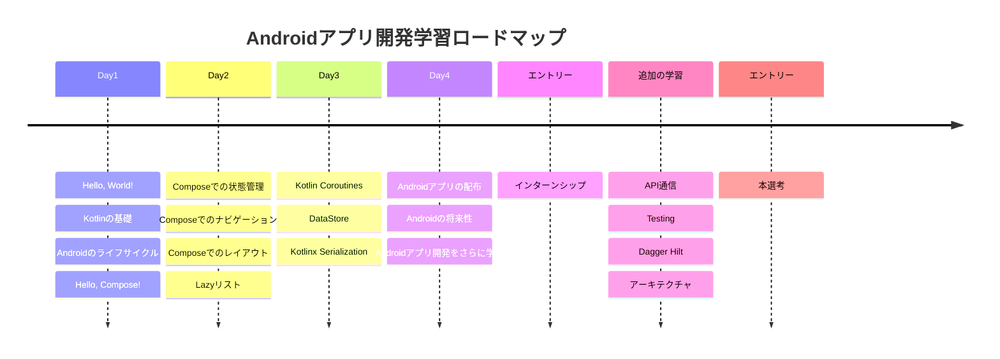

# Android BootCamp Iwate Prefectural University


## 概要
Android BootCampへようこそ！

KotlinとJetpack Composeを用いたAndroidアプリ開発を基礎から学ぶ講座です。  
最終的に一人でも初歩的なAndroidアプリを作成できること目的としています。

> [!NOTE]
> UI作成に加えて、簡単なデータの永続化ができるものを初歩的なアプリとしています。

## ロードマップ

Day1~Day4までの全てを修了すると、各社のインターンに最低限提出できるアプリ（成果物）を開発する能力が身に付きます。

さらに自身で追加の学習を行うことで、本選考で必要なレベルに達することができます。



## 事前準備

アプリ開発に必要なIDE（統合開発環境）のインストールと、講座で利用するプロジェクトをクローンします。

1. **Android Studioのインストール**

   [Android Studio のインストール手順](https://developer.android.com/codelabs/basic-android-kotlin-compose-install-android-studio?hl=ja#0)に従ってダウンロードしましょう。

2. **Gitのセットアップ**

   まず、[Gitのダウンロードページ](https://git-scm.com/downloads)にアクセスし、インストールまで完了させましょう。

   インストール後、以下のコマンドで初期設定を行います。

   ```bash
   # ユーザー名の設定（自分の名前に置き換えてください）
   git config --global user.name "あなたの名前"

   # メールアドレスの設定（自分のメールアドレスに置き換えてください）
   git config --global user.email "your-email@example.com"

   # 設定の確認
   git config --list
   ```

   詳細は[Git のセットアップガイド](https://docs.github.com/ja/get-started/getting-started-with-git/set-up-git#setting-up-git)を参照してください。

3. **本プロジェクトのクローン**

   ターミナル（コマンドプロンプト）を開き、以下のコマンドを実行します：

   ```bash
   # プロジェクトをクローン
   git clone https://github.com/CyberAgentHack/android-bootcamp-iwate-pref.git

   # クローンしたディレクトリに移動
   cd android-bootcamp-iwate-pref
   ```

   参考：[HTTPS URL を使用したクローン方法](https://docs.github.com/ja/get-started/getting-started-with-git/about-remote-repositories#cloning-with-https-urls)

   クローンのコマンドを実行時、ユーザ名とパスワードが求められる場合があります。
   その場合はこちらの[記事](https://zenn.dev/hiromu_ushihara/articles/65cf3c28e29608#https%E3%81%A7%E3%81%AE%E9%80%9A%E5%B8%B8%E3%81%AE%E3%82%A2%E3%82%AF%E3%82%BB%E3%82%B9%EF%BC%88%E5%80%8B%E4%BA%BA%E3%83%AA%E3%83%9D%E3%82%B8%E3%83%88%E3%83%AA%EF%BC%89)を参考にして下さい。

## Day1
### 導入
1. Hello, World!
2. Kotlinの基礎
3. Androidのライフサイクル
4. Hello, Compose!

### 宿題
Column、RowをはじめとしたJetpack ComposeのUIを調査して自分なりにレイアウトを構築してみましょう！  
レイアウトできたらスクリーンショット(または動画)を撮り、`#android_bootcamp2025`に投稿してください！  
(サイバーエージェント社員にメンションもお願いします)

参考サイト
- [Compose レイアウトの基本](https://developer.android.com/develop/ui/compose/layouts/basics)
- [Compose の基本レイアウト](https://developer.android.com/codelabs/jetpack-compose-layouts)
