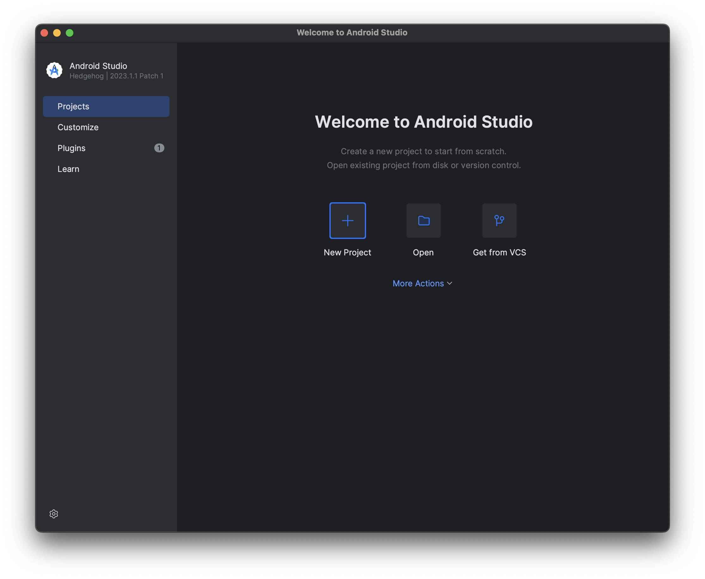
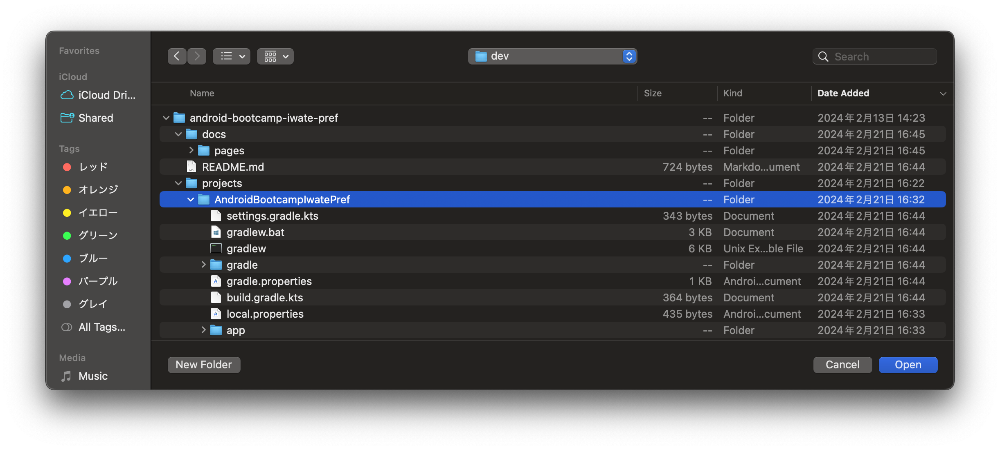
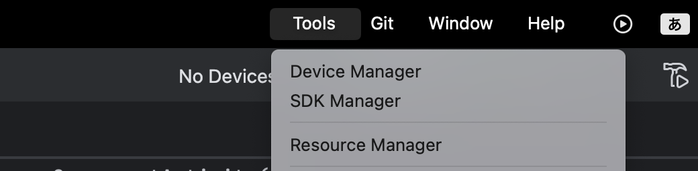
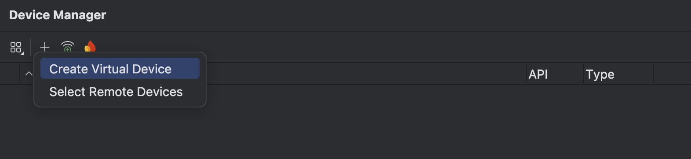
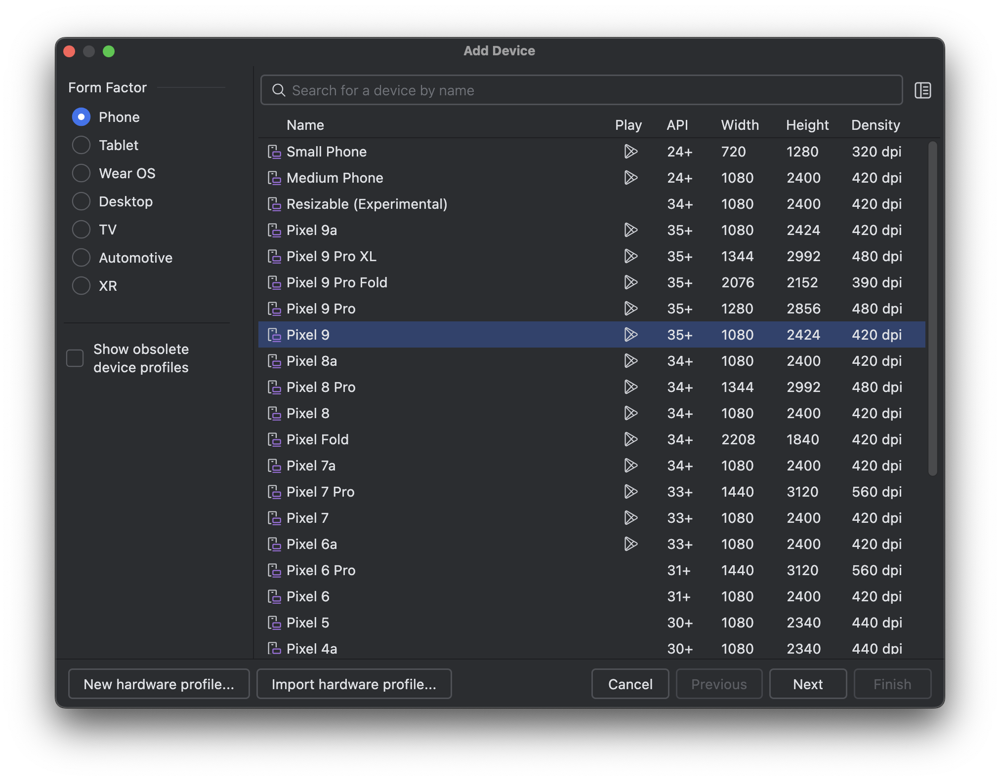
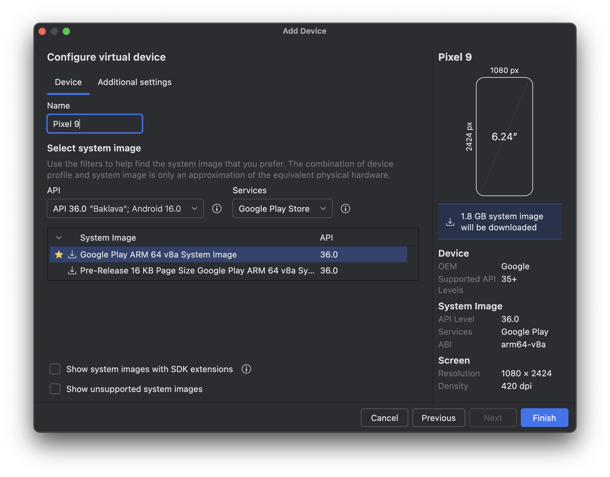
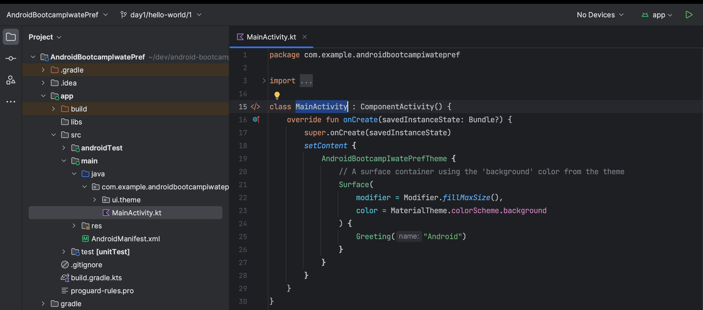
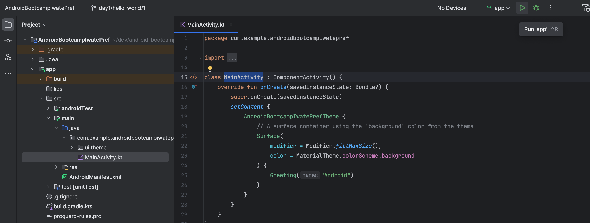
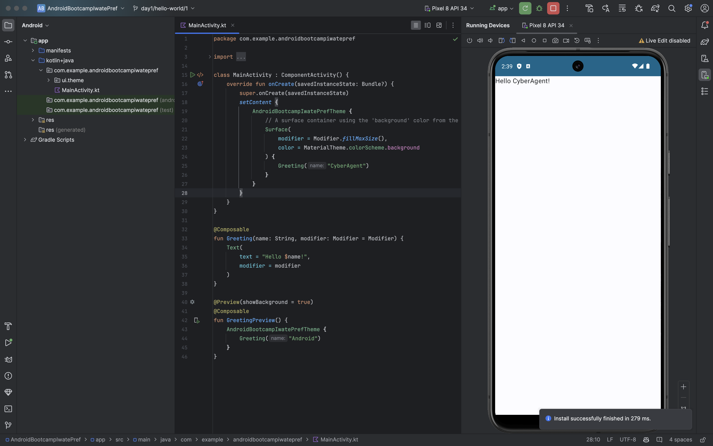

# Hello, World！

今後のブートキャンプを通して利用するAndroidプロジェクトを開き、はじめてアプリを実行するまでの手順を説明します。

## Androidプロジェクトを開く

AndroidStudioのウィザードの[Open]をクリックします。



ファイルを選択するポップアップが表示されたら、クローンしたリポジトリ内の`AndroidBootcampIwatePref`を選択します。



> [!IMPORTANT]
> Androidプロジェクトは[Gradle](https://gradle.org)[^1]というビルドツールを利用するため、`gradle.properties`などがルートにあるプロジェクトを選択する必要があります。

## プロジェクトを同期させる

はじめてAndroidプロジェクトを開くと、自動的にプロジェクトの同期[^2]処理が始まります。

主にこれらの処理が実行されます。

- ライブラリのダウンロード
- 依存関係の解決

基本的に作業は不要ですが、場合によっては同期エラーになる場合があります。

## エミュレータの準備

AndroidStudioにはAndroidエミュレータ[^3]があるので、Androidデバイスを持っていなくても開発ができます。

上部メニューから[Tools > DeviceManager]を選択します。



追加ボタンをクリックし、さらに[Create Virtual Device]をクリックします。



様々なデバイスのエミュレータが利用可能ですが、今回は最新のモバイルデバイスのものを利用します。

選択したら、[Next]をクリックします。

※資料作成時点の最新モバイルデバイスは`Pixel 9`だったため、それを選択しています。



メモリなど詳細な設定ができる画面が表示されますが、今回は何も変更せずに[Finish]をクリックします。

その後はダウンロードが開始します。




## MainActivityを見つける

`:app`モジュール内のMainActivityを開いてみましょう。



`Activity`[^4]の役割や`onCreate`などのライフサイクルの説明は[3. Androidのライフサイクル](./1-3_android-lifecycle.md)でしますが、今はアプリ起動後の始めに実行されるコードが記載されていると思って問題ありません。

> [!TIP]
> 左側に表示される[Project]ツールでトグルボタンを`Android`から`Project`に切り替えることで、実際のディレクトリと同じようにファイルを表示できます。

## 実機での開発（オプション）

エミュレータの代わりに、お持ちのAndroidデバイスでアプリを実行することも可能です。

実機での開発を行うには、デバイスの開発者オプションとUSBデバッグ[^5]を有効にする必要があります。

詳しい設定方法は[Android公式ドキュメント](https://developer.android.com/studio/debug/dev-options?hl=ja#enable)を参照してください。

## アプリを実行する

Androidアプリをデバイスにインストールして使うためには、まずアプリのビルド[^6]が必要です。

ビルドとは、Androidで実行できるファイルを作成するプロセスを指します。
このプロセスには、コンパイル[^7]、難読化、圧縮など様々な工程があります。

ビルドが成功したら、アプリのインストールと起動をすることで、アプリが実行されます。

Android Studioの右上の[実行ボタン▶️]をクリックすると、これらの一連の処理を実行できます。



```mermaid
flowchart LR
    A[実行ボタン] --> B[ビルドプロセス開始]
    B --> C[コンパイル]
    C --> D[難読化]
    D --> E[圧縮]
    E --> F{ビルド成功?}
    F -->|Yes| G[APKファイル[^8]生成]
    F -->|No| H[ビルドエラー]
    H --> I[エラー修正]
    I --> B
    G --> J[デバイスにインストール]
    J --> K[アプリ起動]
    K --> L[アプリ実行]

    style A fill:#e1f5fe
    style G fill:#c8e6c9
    style L fill:#c8e6c9
    style H fill:#ffcdd2
```

ビルドに成功すると画面に「Hello Android!」という文字が表示されます。


> [!TIP]
> スクリーンショットではエミュレータでアプリを起動していますが、実機でも起動することは可能です。

## 表示する文字列を変更する

`MainActivity`内で`Greeting(...)`関数の呼び出し箇所を見つけましょう。  
`"Android"`という文字列を引数にとって、挨拶をしてくれる関数なので、ここを好きな文字に替え、再度ビルドをしてみましょう。

そして、アプリに表示される文字列が替わることを確認してください。




このようにコードを変更し、ビルドして、アプリの挙動確認するのが基本的な開発の流れになります。

[^1]: Gradle - Androidアプリのビルド自動化ツール。依存関係の管理、ビルド設定、タスクの実行などを行います。https://gradle.org
[^2]: 同期（Sync） - Android Studioがプロジェクトの構成を理解し、ライブラリの依存関係をダウンロード・解決して開発環境を最新の状態にする処理
[^3]: エミュレータ - PC上で仮想的にAndroidデバイスを動作させるソフトウェア。Android Virtual Device (AVD) とも呼ばれる
[^4]: Activity - Androidアプリの画面を表すコンポーネント。1つの画面 = 1つのActivityとして実装されることが多い
[^5]: USBデバッグ - 開発用PCとAndroidデバイスをUSBで接続し、アプリのインストールやデバッグを可能にする機能。開発者向けオプションから有効化する
[^6]: ビルド - ソースコードから実行可能なアプリケーション（APKファイル）を生成するプロセス。コンパイル → 難読化 → 圧縮 → APK生成の流れ
[^7]: コンパイル - 人間が書いたソースコード（Kotlin/Java）を機械が理解できるバイトコードに変換する処理。Kotlinの場合、Kotlin → Java バイトコード → DEX（Dalvik Executable）へ変換
[^8]: APKファイル - Android Package Kit の略。Androidアプリの配布・インストール用ファイル形式（.apk）。ZIPファイル形式で、アプリのコード、リソース、証明書などを含む