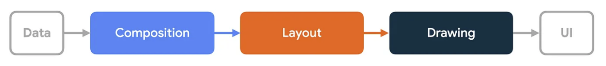
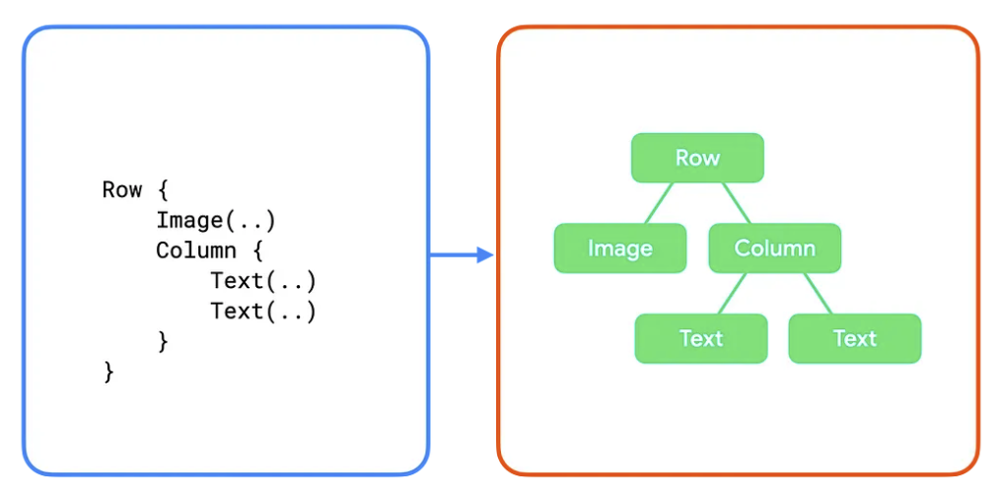
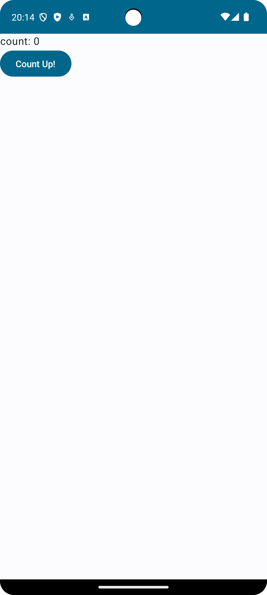

# 1. Composeでの状態管理

## Jetpack Composeのフェーズ
状態管理に入る前にJetpack Composeがどのように描画されているか仕組みを理解しましょう！  
Jetpack Composeの描画には主にComposition、Layout、Drawingの3つのフェーズがあります。  
それぞれのフェーズについてみていきましょう！



[Jetpack Compose のフェーズ](https://developer.android.com/jetpack/compose/phases?hl=ja)より引用

### Composition
UIに何を表示するかを決定するフェーズです。
Composable関数が実行され、UIツリーを生成します。
UIツリーのノードはそれぞれのComposable関数が対応しています。
このノード情報は次のレイアウトフェーズの入力として利用されます。

[動画: Compositionフェーズ](https://developer.android.com/static/develop/ui/compose/images/composition.mp4)


[フレームの 3 つのフェーズ 図3. 対応するコードを含む UI ツリーのサブセクション。](https://developer.android.com/jetpack/compose/phases?hl=ja)より引用

### Layout
Compositionフェーズで生成されたUIツリーを元に各ノードのサイズや位置を決定します。 

このフェーズでは、次の3段階のアルゴリズムを使用してツリーを走査します。

1. 子ノードの測定: 子ノードが存在する場合、その子ノードを測​​定します。
1. 自身のサイズを決定: 子ノードの測定値に基づいて、ノードは自身のサイズを決定します。
1. 子ノードを配置: 各子ノードは、ノード自身の位置を基準として配置されます。

[動画: Layoutフェーズ](https://developer.android.com/static/develop/ui/compose/images/layout.mp4)

[参考](https://developer.android.com/develop/ui/compose/phases?hl=ja#layout)

レイアウトフェーズが完了すると、ノードは次のことが決定します。

- 割り当てられた幅と高さ
- 描画するx ,y座標

### Drawing
描画フェーズでは、ツリーが上から下へ再度走査され、各ノードが順番に画面上に描画されます。

[動画: Drawingフェーズ](https://developer.android.com/static/develop/ui/compose/images/drawing.mp4)

[参考](https://developer.android.com/develop/ui/compose/phases?hl=ja#drawing)

## 状態とは
公式ページには以下のように書いています。　　
> アプリにおいて状態とは、時間とともに変化する可能性がある値を指します。  

[状態と Jetpack Compose](https://developer.android.com/jetpack/compose/state?hl=ja) より引用

通常、再コンポジションが起こると変数等の状態は保持されず、まっさらな状態になってしまいます。  
そのため、状態を保持することを考慮しなければなりません。  
今回は状態について手を動かしながら学んでいきましょう！

## カウントアップを実装しながら状態を学ぼう

### カウントアップ用のUIを作りましょう
まず最初にカウントアップのUIを作るためのComposable関数を作っていきます。

```kt
@Composable
fun CountUp(
    modifier: Modifier = Modifier,
) {
    Column(
        modifier = modifier,
    ) {
        Text("count: 0")
        Button(
            onClick = {
                // TODO: Implement
            }
        ) {
            Text("Count Up!")
        }
    }
}
```

一旦ここまでできたら実行しましょう！  



こちらのスクリーンショットのような画面が出たら次のステップへ進みましょう！

### カウントアップを実装しましょう
さて、UIができたら次はカウントアップのロジックを実装していきます。  
現状作ったUIの `Count Up!` ボタンを押しても何も起きないと思います。  
今回は `Count Up!` ボタンを押した時にカウントの数字がカウントアップするようにしていきましょう！

```kt
@Composable
fun CountUp(
    modifier: Modifier = Modifier,
) {
    var count by remember { mutableStateOf(0) }
    Column(
        modifier = modifier,
    ) {
        Text("count: $count")
        Button(
            onClick = {
               count++
            }
        ) {
            Text("Count Up!")
        }
    }
}
```

ここまでできたら実行しましょう！

`Count Up!` ボタンを押した時にカウントアップされれば成功です！

### 解説

```kt
var count by remember { mutableStateOf(0) }
```

`状態とは` で解説したように、再コンポジションが起きると状態は保持されずにまっさらな状態になります。  
そのため状態を保持するために、Jetpack Composeでは `remember` という機能が提供されています。  
また、 `mutableStateOf` という機能を使うとその値が変化した時に再コンポジションが発生し、UIを再描画させて値をUIへ反映させることができます。  
このように、Jetpack Composeでは `remember` や `Recomposition` を活用してUIを構築します。
