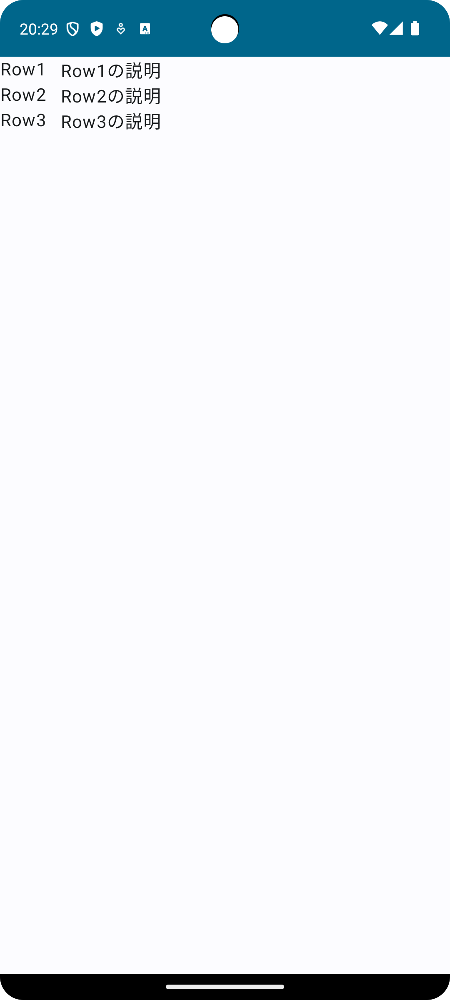

# 2. Composeでのレイアウト

## Jetpack Composeのレイアウトについて 
Jetpack Composeには、さまざまなレイアウトを構築するためのComposable関数があります。  
それらを組み合わせることによって、独自のレイアウトを構築することが可能です。  

まずは[標準レイアウト コンポーネント](https://developer.android.com/develop/ui/compose/layouts/basics?hl=ja#standard-layouts)を眺めてみましょう。


## Column、Rowを用いてレイアウトを構築してみましょう

以下のようなレイアウトを構築してみましょう！  

```kt
@Composable
fun MyLayout() {
    Column {
        Row {
            Text("Row1")
            Spacer(modifier = Modifier.width(12.dp))
            Text("Row1の説明")
        }
        Row {
            Text("Row2")
            Spacer(modifier = Modifier.width(12.dp))
            Text("Row2の説明")
        }
        Row {
            Text("Row3")
            Spacer(modifier = Modifier.width(12.dp))
            Text("Row3の説明")
        }
    }
}
```



このようなコードでも動きますが、Column内の要素が同じような見た目のため、以下のように共通化することができます。

```kt
@Composable
fun MyLayout() {
    Column {
        (1..3).forEach {
            Item(it)
        }
    }
}

@Composable
fun Item(count: Int) {
    Row {
        Text("Row$count")
        Spacer(modifier = Modifier.width(12.dp))
        Text("Row${count}の説明")
    }
}
```

このように共通コンポーネントとしてComposable関数を作ることにより、再利用性を高めることができるようになります。
