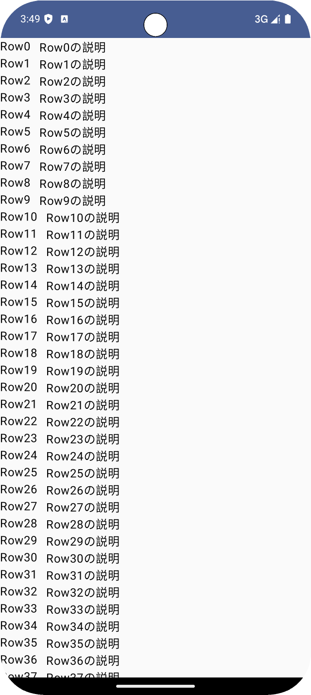

# 3. Lazyリスト

アプリの画面サイズは限られているので、一度に多くのコンテンツの閲覧ができません。  
そこで、多くのアプリはリストをスクロールできるUIを提供しています。

またユーザがコンテンツを探索できるように、何回もスクロールできるリストがほとんどです。

## `Column`と`Row`は大量のデータ表示には適していない

Composeでは`Column(...)`または`Row(...)`を利用して、リストを作成することができます。  
ただし、たくさんのコンテンツを表示するには適していません。

例として、前章で作成した`MyLayout`で`Item`を1000件並ぶように拡張してみましょう。

```kotlin
@Composable
fun HomeScreen(
    modifier: Modifier = Modifier,
) {
    Box(
        modifier = modifier.verticalScroll(rememberScrollState()),
    ) {
        MyLayout()
    }
}

@Composable
fun MyLayout() {
    Column {
        (0..<1000).forEach {
            Item(it)
        }
    }
}

@Composable
fun Item(count: Int) {
    Row {
        Text("Row$count")
        Spacer(modifier = Modifier.width(12.dp))
        Text("Row${count}の説明")
    }
}
```



アプリを実行し、1000件分のアイテムをスクロールして表示できると思います。  
しかし、実はたくさんの余計な処理が実行されていて、パフォーマンスが良くありません。

具体的には、画面外にあるアイテムをレイアウトする計算などが実行されていますが、ユーザに見えないので、無駄な処理になっています。

このサンプルコードのアイテムは`Text()`だけ描画しているので問題に感じませんが、各アイテムに画像を表示させたり、低スペック端末で実行したりすると問題になる場合があります。

Textだけでも、数を 1000件 ではなく 100000件 のような膨大な数に設定してみるとアプリが起動してもすぐにクラッシュしてしまいます。

## 大量のデータ表示には`LazyColumn`または`LazyRow`を利用する

`Column`と`Row`のようなレイアウトで、大量のデータ表示するためには`LazyColumn`または`LazyRow`を利用します。

`MyLayout`を次のように修正してみましょう。

```kotlin
@Composable
fun HomeScreen(
    modifier: Modifier = Modifier,
) {
    Box(
        modifier = modifier, // verticalScrollは削除する
    ) {
        MyLayout()
    }
}

private const val contentTypeOfItem = "CONTENT_TYPE_OF_ITEM"

@Composable
fun MyLayout() {
    LazyColumn {
        items(
            count = 1000,
            key = { index -> index },
            contentType = { contentTypeOfItem },
        ) { count ->
            Item(count)
        }
    }
}

// fun Item(count: Int) の記述はそのまま
```

アプリを実行すると、修正前と同じリストが表示されます。

> [!TIP]
> 修正後のコードではパフォーマンスを最大限良くするために、アイテムの`key`と`contentType`を指定しています。  
> [keyの詳細](https://developer.android.com/develop/ui/compose/lists?hl=ja#item-keys)  
> [contentTypeの詳細](https://developer.android.com/develop/ui/compose/lists?hl=ja#content-type)