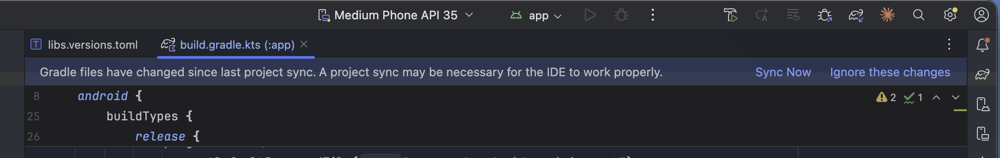
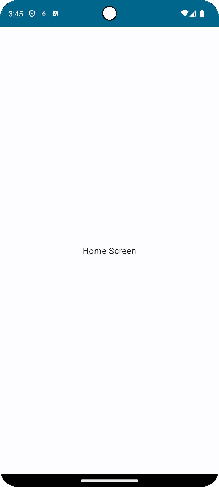
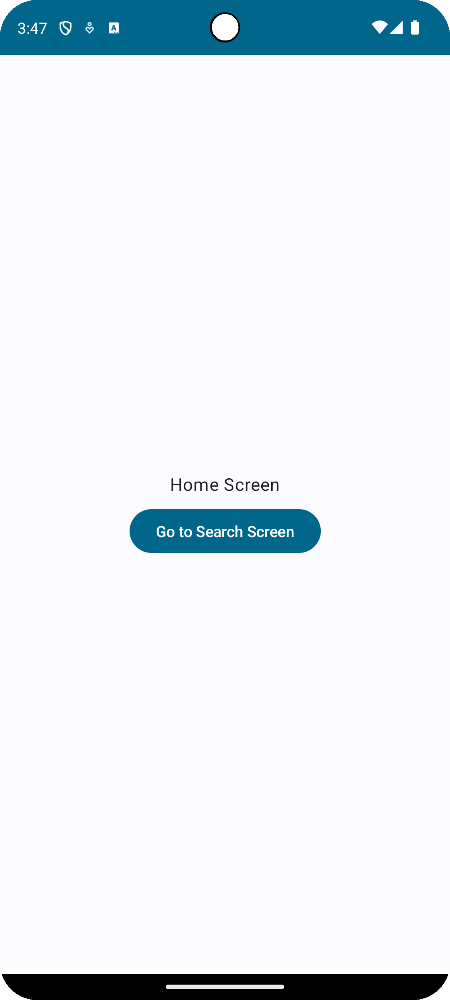

# 4. Compose でのナビゲーション

ほとんどのアプリに複数の画面があり、それを切り替えながら目的を達成します。  
その画面の切り替えをナビゲーション(画面遷移)と呼びます。

> [!TIP]
> Android には[ナビゲーションの原則](https://developer.android.com/guide/navigation/principles?hl=ja)があります。

## Navigation コンポーネント

ここでは[Navigation コンポーネント](https://developer.android.com/guide/navigation?hl=ja)を使って、画面遷移を実装します。

Navigation コンポーネントを使うメリット

- Android のナビゲーション原則に従った実装が簡単にできる
- スタックの管理をライブラリに任せられる
- [その他](https://developer.android.com/guide/navigation?hl=ja#benefits)

## Navigation コンポーネントの導入

Android アプリ開発では多くのライブラリを利用します。  
Navigation コンポーネントもライブラリの一つなので、その導入が必要です。

Navigation コンポーネントを Android プロジェクトに導入するためには、モジュールの依存関係に追加する必要があります。

`app/build.gradle.kts`の`dependencies`ブロックを見てみましょう。  
ここには導入したいライブラリが記載されています。

```kotlin
dependencies {
    implementation(libs.core.ktx)
    implementation(libs.lifecycle.runtime.ktx)
    ...
}
```

同じように Navigation コンポーネントを追加します。

1. バージョンカタログへの記述追加  
   `gradle/libs.versions.toml` に Navigation ライブラリの記述を追加します。

   ```toml
   [versions]
   navigation = "2.8.9"

   [libraries]
   navigation-compose = { group = "androidx.navigation", name = "navigation-compose", version.ref = "navigation" }
   ```

2. モジュールへの依存関係の追加 (今回のプロジェクトでは記述済みなので対応不要)  
   先ほど確認した `app/build.gradle.kts` の `dependencies` ブロックに以下を追記します

   ```kotlin
   dependencies {
       implementation(libs.navigation.compose)
       ...
   }
   ```

3. Sync する  
   `build.gradle.kts` を変更するとエディタ上部に `Sync Now` ボタンが出てくるので押してください。

    

> [!TIP]
> ライブラリのバージョンは[バージョンカタログ](https://developer.android.com/build/migrate-to-catalogs?hl=ja)で行っています。

## 画面を作成する

適当な画面を 2 つ作ります。  
お好みのデザインで問題ありません。

```kotlin
@Composable
fun HomeScreen(
    modifier: Modifier = Modifier,
) {
    Box(
        modifier = modifier,
        contentAlignment = Alignment.Center,
    ) {
        Text(text = "Home Screen")
    }
}
```

```kotlin
@Composable
fun SearchScreen(
    modifier: Modifier = Modifier,
) {
    Box(
        modifier = modifier,
        contentAlignment = Alignment.Center,
    ) {
        Text(text = "Search Screen")
    }
}
```

## ルートを定義する

Compose を使った Navigation コンポーネントでは、シリアル化可能なオブジェクトまたはクラスを使用してルートを定義します。
ルートは、目的地への経路を記述し、目的地に必要なすべての情報を含みます。

今回は `Home` と `Search` を定義してみます。

```kotlin
sealed interface Routes {
    @Serializable
    data object Home : Routes

    @Serializable
    data object Search : Routes
}
```

## NavHost で画面を定義する

`MainActivity`の`setContent`ブロック内を次のように修正します。

```kotlin
setContent { // 既存の setContent
    AndroidBootcampIwatePrefTheme {
        Surface(
            modifier = Modifier.fillMaxSize(),
            color = MaterialTheme.colorScheme.background
        ) {
            val navController = rememberNavController()
            NavHost(
                navController = navController,
                startDestination = Routes.Home,
            ) {
                composable<Routes.Home> {
                    HomeScreen(
                        modifier = Modifier.fillMaxSize(),
                    )
                }
                composable<Routes.Search> {
                    SearchScreen(
                        modifier = Modifier.fillMaxSize(),
                    )
                }
            }
        }
    }
}
```

ここではアプリを構成する画面の定義をしています。

`NavHost`のブロック内に`composable`を書き、そのブロック内に画面の Composable 関数を定義しています。  
composable の型引数には目的地までの経路を表現するルートを指定します。  
画面遷移は型引数に設定した型のインスタンス (ルートインスタンス) を指定することで行われます。

上記のコードでは、ホーム画面(route: `Routes.Home`)と検索画面(route: `Routes.Search`)を定義しています。

ここまでのコードを実行するとホーム画面が表示されます。  
これは`NavHost`の`startDestination`引数に`Routes.Home`を指定し、ホーム画面を最初の画面にしているからです。



## ホーム画面から検索画面に遷移する

前節のコードだけではまだ画面遷移ができていません。  
画面遷移をするためには、`navController.navigate(...)`を呼び出す必要があります。

ホーム画面から検索画面に遷移する実装をしていきましょう。

まず、ホーム画面にクリック可能な UI を作成しましょう。  
例ではボタンを配置していますが、好きなものを配置しても良いです。

```kotlin
@Composable
fun HomeScreen(
    modifier: Modifier = Modifier,
) {
    Box(
        modifier = modifier,
        contentAlignment = Alignment.Center,
    ) {
        Column(
            modifier = Modifier,
            verticalArrangement = Arrangement.spacedBy(8.dp),
            horizontalAlignment = Alignment.CenterHorizontally,
        ) {
            Text(text ="Home Screen")
            Button(onClick = { /*TODO*/ }) {
                Text(text = "Go to Search Screen")
            }
        }
    }
}
```



次にクリックイベントを実装します。

```kotlin
@Composable
fun HomeScreen(
    modifier: Modifier = Modifier,
    navigateTo: (route: Routes) -> Unit, // 追加
) {
    Box(
        modifier = modifier,
        contentAlignment = Alignment.Center,
    ) {
        Column(
            modifier = Modifier,
            verticalArrangement = Arrangement.spacedBy(8.dp),
            horizontalAlignment = Alignment.CenterHorizontally,
        ) {
            Text(text ="Home Screen")
            Button(onClick = { navigateTo(Routes.Search) }) { // 追加
                Text(text = "Go to Search Screen")
            }
        }
    }
}
```

`HomeScreen(...)`の呼び出し側も修正します。

```kotlin
val navController = rememberNavController()
NavHost(
    navController = navController,
    startDestination = Routes.Home,
) {
    composable<Routes.Home> {
        HomeScreen(
            modifier = Modifier.fillMaxSize(),
            // 追加
            navigateTo = { route ->
                navController.navigate(route)
            }
        )
    }
    // ...
}
```

ビルドしてボタンをクリックしてみましょう。  
ホーム画面から検索画面に遷移するはずです。

このように画面遷移は`navController.navigate(...)`に画面の`route`を指定することできます。

## ナビゲーション時に引数を渡す

「検索画面に検索キーワード渡したい」のようにナビゲーション時に外から値を渡したくなるケースもあります。
ルートを定義した時に `object` で定義をしましたが、`data class` を用いて定義することもできます。

1. `Routes.Search` のルート定義を編集する。

   `Routes.Search` をデータクラスにすることで、インスタンス化時に `keyword` というプロパティを保持できるようにします。

   ```diff
   @Serializable
   - data object Search : Routes
   + data class Search(val keyword: String) : Routes
   ```

2. ホーム画面のコンポーザブルを修正する

   `Routes.Search` の定義が変わったので既に使っている部分を修正します。  
   `keyword` に好きな言葉を入れてみても問題ありません。

   ```kotlin
   @Composable
   fun HomeScreen(
       modifier: Modifier = Modifier,
       navigateTo: (route: Routes) -> Unit,
   ) {
       val keyword = "hoge" // 追加

       Box(
           modifier = modifier,
           contentAlignment = Alignment.Center,
       ) {
           Column(
               modifier = Modifier,
               verticalArrangement = Arrangement.spacedBy(8.dp),
               horizontalAlignment = Alignment.CenterHorizontally,
           ) {
               Text(text = "Home Screen")
               Button(onClick = { navigateTo(Routes.Search(keyword = keyword)) }) { // 変更
                   Text(text = "Go to Search Screen")
               }
               Text(text = "keyword: $keyword") // 追加 (任意)
           }
       }
   }
   ```

3. 検索画面のコンポーザブルを修正する

   `SearchScreen` を編集し外から文字列を与えられるように修正します。

   ```kotlin
   @Composable
   fun SearchScreen(
       keyword: String, // 追加
       modifier: Modifier = Modifier,
   ) {
       Box(
           modifier = modifier,
           contentAlignment = Alignment.Center,
       ) {
           Text(text = "Search result about「$keyword」") // 変更
       }
   }
   ```

4. ナビゲーションを修正する
   最後に、`NavHost` 内の `Routes.Search` 用の `composable<T>` ブロックを編集します。

   ```kotlin
   NavHost(...) {
       composable<Home> {...}

       // 以下のように修正
       composable<Routes.Search> { backStackEntry ->
           val args = backStackEntry.toRoute<Routes.Search>()
           SearchScreen(
               keyword = args.keyword,
               modifier = Modifier.fillMaxSize(),
           )
       }
   }
   ```

今まで省略されていましたが、`NavHost` に書いていた `composable<T>` ラムダでは NavBackStackEntry というオブジェクトを参照することができます。  
遷移時に与えられたルートインスタンスは `NavBackStackEntry.toRoute()` で取得できます。

上記の例では、`backStackEntry.toRoute<Routes.Search>()` で `Routes.Search`型 のインスタンスを取得し  
`SearchScreen()` の `keyword` には `Routes.Search.keyword` を渡して表示しています。

| ホーム                                             | 検索結果                                           |
| -------------------------------------------------- | -------------------------------------------------- |
|  |  |

> [!TIP]
> 参考資料
>
> - [ナビゲーション | App architecture | Android Developers](https://developer.android.com/guide/navigation?hl=ja)
> - [ナビゲーション グラフを設計する | App architecture | Android Developers](https://developer.android.com/guide/navigation/design?hl=ja)
