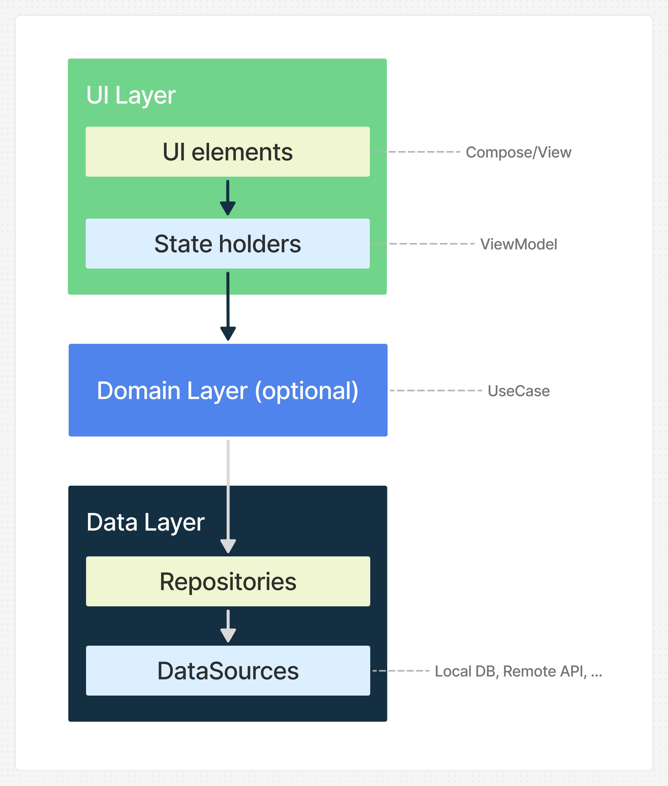

# 1. Androidアプリの設計原則 と ViewModel・Repository を用いた構造化

## 今までのコードの問題点

今までのハンズオンでは、Composable関数の中で状態管理やロジックを書いてきました。
しかし、実際のアプリ開発では、この方法だけでは以下のような問題が起きてしまいます：

- 画面を回転すると、入力したデータが消えてしまう
- 同じ処理を別の画面でも使いたいのに、コードをコピーすることになる
- テストを書くのが難しい
- チームで開発する時、誰がどこを修正すればいいのかわからない

これらの問題を解決するために、Androidでは「[アプリアーキテクチャガイド](https://developer.android.com/topic/architecture?hl=ja)」という設計の指針が用意されています。  

この章では、次の3-2・3-3で実装する**ViewModel**と**Repository**の役割を理解するために、
アプリアーキテクチャ(アプリ全体の構造や設計) の基本的な考え方を学びます。


## 重要な設計原則：関心の分離

アプリアーキテクチャガイドではいくつかの設計原則が紹介されていますが、今回は **「関心の分離」** という設計原則を紹介します。  
これは **「一つのクラスには一つの責任だけを持たせる」** という原則です。

### ❌ 悪い例：すべてを一つの場所に書く

Day2までのハンズオンでは、Composable関数やMainActivityの中にすべてを書いていました：

```kotlin
@Composable
fun TodoScreen() {
    var todoList by remember { mutableStateOf(listOf<String>()) }
    var inputText by remember { mutableStateOf("") }

    Column {
        TextField(
            value = inputText,
            onValueChange = { inputText = it }
        )

        Button(onClick = {
            todoList = todoList + inputText  // データ追加
            // ここでAPIへの送信...?
            // ここでデータベースへの保存...?
            inputText = ""
        }) {
            Text("追加")
        }

        todoList.forEach { todo ->
            Text(todo)
        }
    }
}
```

**問題点：**

- **画面を回転すると`todoList`が消えてしまう**
- 表示・状態管理・データ保存が全部混ざっている
- 別の画面で同じロジックを使いたい時、コードをコピーすることになる
- テストが書けない

### ✅ 良い例：役割を分ける

ViewModelとRepositoryを使うと、役割を明確に分けられます：

```
[UI（Compose）]
    ↓ ユーザーがボタンをタップ
[ViewModel]
    ↓ TODOを追加する処理
[Repository]
    ↓ データベースに保存する処理
```

このように役割を分けることで：

- **UI**: 画面に表示するだけに集中
- **ViewModel**: 画面の状態を管理し、画面回転でも生き残る
- **Repository**: データの取得・保存を担当

それぞれが独立してテストでき、変更の影響も限定的になります。

> [!TIP]
> **参考：他の設計原則**
>
> アプリアーキテクチャガイドには「単一の情報源（SSOT）」や「単方向データフロー（UDF）」という原則もあります。
> これらについては、[Android公式ドキュメント](https://developer.android.com/topic/architecture?hl=ja)で詳しく学べます。  
> 興味のある方はぜひ読んでみてください！

## Androidの推奨アプリアーキテクチャ：3層構造

### アーキテクチャの全体像

アプリアーキテクチャガイドでは推奨されるアプリアーキテクチャとして、**3つの層**で構成された構造が紹介されています：



**重要なポイント：**

- 依存関係は**常に上から下(UIからdata)への一方向**
- 各層は独立してテストできる
- 変更の影響範囲を限定できる

### 1. UI Layer（UIレイヤ）

**役割：** ユーザーが実際に見て操作する部分

このレイヤは2つの要素で構成されます：

#### UI要素（Compose/View）

- 画面にデータを表示するUI要素
- ユーザーの操作を受け取る
- **データを受け取って表示するだけ**に徹する

Day2までのハンズオンで作ってきたComposable関数がこれにあたります。

#### ViewModel

ViewModelは、UIレイヤの中でもデータを保持したりロジックを処理する責務を持ちます。  
アプリアーキテクチャガイドでは 状態ホルダー(State holders) とも呼ばれてます。

**ViewModelの役割：**

1. **画面の状態を保持する**
   - UIに表示するデータを管理する
   - ユーザーの入力状態を保持する

2. **画面回転などの構成変更を生き延びる**
   - Activityが再作成されても、ViewModelは破棄されない
   - ユーザーが入力したデータが消えない

3. **ビジネスロジックを処理する**
   - ボタンがタップされた時の処理
   - データの加工やバリデーション

4. **Repositoryとやり取りする**
   - データの取得や保存を依頼する
   - 取得したデータをUIに公開する

**なぜViewModelが必要？ : 画面回転の例**

`remember`を使った状態管理は、画面回転で消えてしまいます：

```kotlin
// ❌ 画面回転でcountが0に戻る
var count by remember { mutableStateOf(0) }
```

ViewModelを使えば、画面回転でも状態が保持されます：

```kotlin
// ✅ 画面回転してもcountが保持される
class CountViewModel : ViewModel() {
    var count by mutableStateOf(0)
}
```


### 2. Data Layer（データレイヤ）

**役割：** データの取得・保存とビジネスロジックの管理

#### Repository

Repositoryは、データレイヤの中心的なコンポーネントです。

**Repositoryの役割：**

1. **データソースを隠蔽する**
   - ViewModelは、データがどこから来るか知らなくていい
     - どこから ... 端末内? ネットワーク上?
   - ローカルDB、API、キャッシュなどを使い分ける

2. **複数のデータソースを組み合わせる**
   - 「まずキャッシュから表示、その後APIから最新データを取得」などの処理
   - オフライン対応などの複雑なロジックを一箇所で管理

3. **データの整合性を保証する**
   - 全ての画面が同じRepositoryを使うことで、データの不整合を防ぐ

**なぜRepositoryが必要？**

各画面で直接APIを呼び出すと、同じコードが散らばってしまいます：

```kotlin
// ❌ 各画面で同じAPI呼び出しコードを書く
@Composable
fun UserScreen() {
    val user = apiClient.getUser(id)
}

@Composable
fun ProfileScreen() {
    val user = apiClient.getUser(id) // 同じコードを書く必要がある
}
```

Repositoryを使えば、一箇所で管理できます：

```kotlin
// ✅ Repositoryで一元管理
class UserRepository(private val api: UserApi) {
    fun getUser(id: String) = api.getUser(id)
}

// ViewModelから使う
class UserViewModel(private val repository: UserRepository) : ViewModel() {
    val user = repository.getUser(id)
}
```

**具体例：複雑なデータ取得**

Repositoryを使えば、データ取得の複雑な処理をViewModelから隠蔽できます。

```kotlin
// Repository：複雑なオフライン対応ロジックを実装
class NewsRepository(
    private val api: NewsApi,
    private val dataStore: NewsDataSource
) {
    /**
     * ニュースリストを取得するFlow
     * データの更新が終わるまでは端末に保存されたニュースを表示する
     */
    fun getNewsList() = flow {
        // 1. まずは端末内に保存していたデータを即座に提供 (キャッシュ)
        emit(dataStore.getSavedNewsList())

        // 2. バッググラウンドでAPIから最新のデータを取得
        try {
            val latestNewsList = api.getLatestNewsList()
            dataStore.updateSavedNewsList(latestNewsList)
            emit(latestNewsList)
        } catch (e: Exception) {
            // オフラインなどの理由でapi経由での取得に失敗した場合は
            // キャッシュデータのまま
        }
    }
}

// ----------------------------------------------------------------

// ViewModel：シンプルに呼び出すだけ
class NewsListViewModel(
    private val repository: NewsRepository
) : ViewModel() {

    // Repositoryを呼ぶだけ。キャッシュやAPIの詳細は知らなくていい
    val newsList = repository.getNewsList()
        .stateIn(
            scope = viewModelScope,
            started = SharingStarted.Eagerly,
            initialValue = emptyList()
        )
}
```

**メリット：**

- **ViewModelがシンプルになる**：データ取得の複雑さを意識せず、`repository.getNewsList()`を呼ぶだけ
- **ViewModelが本来の責務に集中できる**：UI状態の管理やユーザー操作への対応に専念できる
- **再利用性が高まる**：同じオフライン対応ロジックを全ての画面で使い回せる


### 3. Domain Layer（ドメインレイヤ）【オプション】

**役割：** 複雑なビジネスロジックの再利用

このレイヤは**必須ではありません**。アプリが成長して複雑になった時に導入を検討します。

#### UseCase

- 複数の画面で使われる複雑なロジックを一箇所にまとめる
- 例：「ユーザーの年齢を計算して特別オファーを表示する」など

> [!TIP]
> 小規模なアプリでは、ViewModelに直接ビジネスロジックを書いても問題ありません。  
> 必要に応じて後から導入を検討しましょう。


## 実装例：全体の流れを理解する

では、ユーザー情報を取得して表示する簡単な例で、`UI`/`ViewModel`/`Repository`/`DataSource` たちがどう連携するか見てみましょう。

### データの流れ

```text
1. ユーザーが画面を開く
    ↓
2. UI が ViewModel に「ユーザー情報を表示したい」と要求
    ↓
3. ViewModel が Repository に「ユーザー情報を取得して」と依頼
    ↓
4. Repository が DataSource（DBやAPI）からデータを取得
    ↓
5. Repository → ViewModel → UI の順にデータが流れる
    ↓
6. 画面にユーザー情報が表示される
```

### コード例

#### 1. Repository（データレイヤ）

```kotlin
class UserRepository(
    private val api: UserApi,
    private val database: UserDao
) {
    fun getUser(id: String) = flow {
        // まずキャッシュから即座にデータを提供
        emit(database.getUser(id))

        // バックグラウンドでAPIから最新データを取得
        val freshData = api.getUser(id)
        database.save(freshData)

        // 最新データをUIに反映
        emit(freshData)
    }
}
```

#### 2. ViewModel（UIレイヤ）

```kotlin
class UserViewModel(
    private val repository: UserRepository
) : ViewModel() {
    // UIに公開する状態
    val userState = repository.getUser("123")
        .stateIn(
            scope = viewModelScope,
            started = SharingStarted.Eagerly,
            initialValue = null
        )
}
```

#### 3. UI（UIレイヤ）

```kotlin
@Composable
fun UserScreen(viewModel: UserViewModel) {
    val user by viewModel.userState.collectAsState()

    Text(text = user?.name ?: "Loading...")
}
```

### ポイント

- **UI** は ViewModel の状態を**観察するだけ**
- **ViewModel** は Repository からデータを取得して**状態を保持するだけ**
- **Repository** は実際のデータ取得を**担当するだけ**

それぞれが一つの責任に集中し、独立してテストできます。


## よくある質問

### Q1: 最初から完璧な設計でアプリを作らないとダメ？

**A:** いいえ、必要ありません。

- 小規模なアプリでは、シンプルな構造から始めてOK
- アプリが成長するにつれて、段階的に改善していく
- 最初は ViewModel と Repository だけでも十分

### Q2: いつアーキテクチャや設計を意識すべき？

**A:** 以下のような場面で必要性を感じたら導入を検討しましょう：

- 画面回転でデータが消えて困る
- 同じ処理やデータを複数の画面で使いたい
- メンテナンスしやすいアプリを実装したい
- テストを書きたい
- チームで開発する

### Q3: Domain Layer（UseCase）は必須？

**A:** いいえ、必須ではなく必要に応じて追加しましょう。

- 小規模なアプリでは不要
- ViewModel に直接ロジックを書いても問題ない
- 複雑なビジネスロジックや共通化の要件が増えてきたら検討


## まとめ

### この章で学んだこと

1. **関心の分離**：一つのクラスには一つの責任だけを持たせる
2. **ViewModel**：画面の状態を保持し、画面回転でも生き残る
3. **Repository**：データソースを隠蔽し、データを一元管理する
4. **3層構造**：UI Layer → Domain Layer（オプション）→ Data Layer

### 次のステップ

この章では、アプリアーキテクチャの**理論**を学びました。
次の章では、実際に手を動かして実装していきます：

- **3-2**: ViewModel の実装
- **3-3**: Repository の実装


### 参考リンク

- [Android公式：アプリアーキテクチャガイド](https://developer.android.com/topic/architecture?hl=ja)
- [Android公式：推奨アプリアーキテクチャ](https://developer.android.com/topic/architecture/recommendations?hl=ja)
