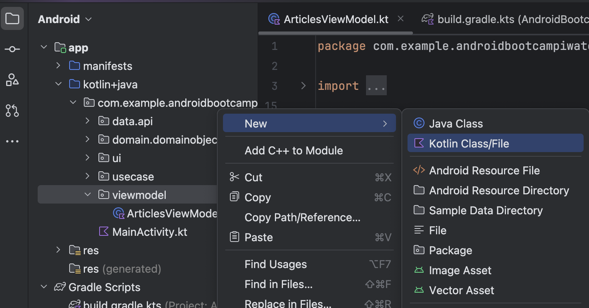
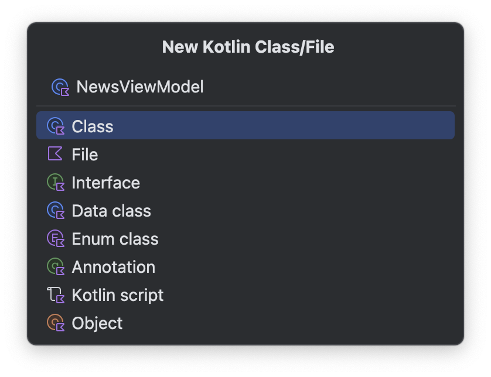
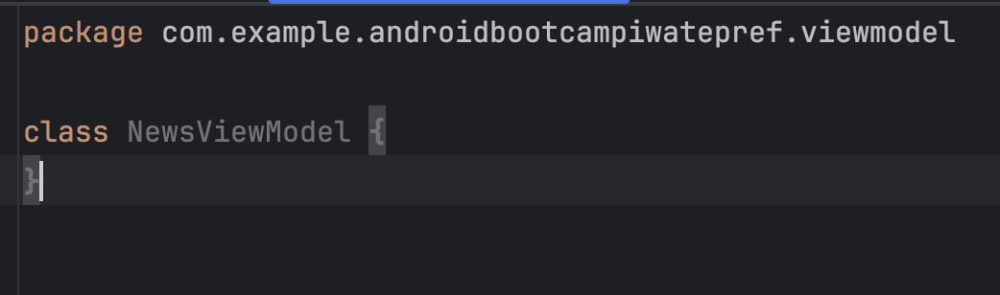
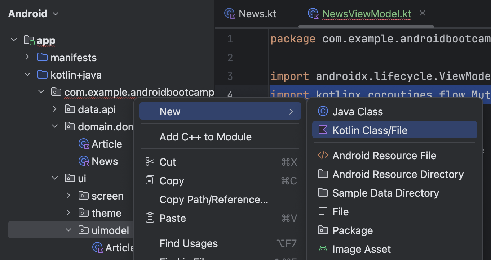
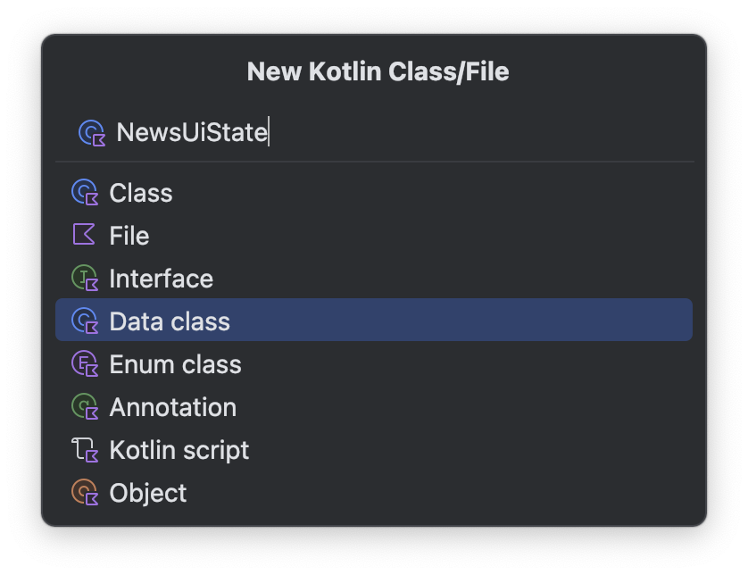
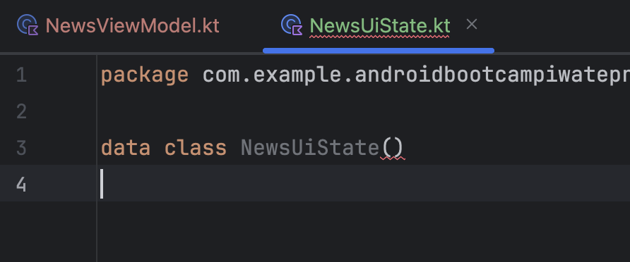
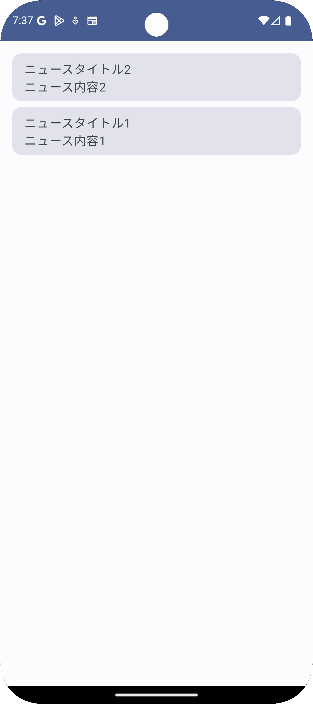

# 2. ViewModelの使い方

ViewModelを追加・実装し、使い方を学びましょう。

## ViewModelクラスの追加

`NewsViewModel`を追加します。

### `NewsViewModel`クラスの追加
まずは左のエクスプローラーの`viewmodel`パッケージを右クリックし、`New` > `Kotlin Class/File`を選択します。



`Kotlin Class/File`ウィンドウが表示されたら、`NewsViewModel`を入力し、Enter入力もしくは`Class`をダブルクリックします。



完了すると、空の`NewsViewModel`クラスが作成されます。



### `androidx.lifecycle.ViewModel`の継承

空の`NewsViewModel`クラスのままでは何も機能しませんが、`androidx.lifecycle.ViewModel`を継承することでその機能を使うことができます。

以下のコードのように修正しましょう。

1. `import androidx.lifecycle.ViewModel`を追加する
1. `NewsViewModel`に`ViewModel`を継承する

```kotlin
import androidx.lifecycle.ViewModel

class NewsViewModel : ViewModel() {
}
```

## ViewModelでのUI状態の保持

`kotlinx.coroutines.flow.StateFlow`を利用して、ViewModelでUI状態を保持する実装を追加します。

> [!TIP]
> `kotlinx.coroutines.flow.StateFlow`はKotlinのCoroutinesの機能の一つです。本ブートキャンプでは`Coroutines`の詳しい説明はしませんが、Androidアプリ開発で非同期処理を実装する重要なものです。
> 参考：[StateFlow と SharedFlow | Kotlin | Android Developers](https://developer.android.com/kotlin/flow/stateflow-and-sharedflow?hl=ja)

### 状態ホルダークラスの追加

`NewsUiState`クラスを追加します。  
`uimodel`パッケージを右クリックし、`New` > `Kotlin Class/File`を選択します。



`Kotlin Class/File`ウィンドウが表示されたら、`NewsUiState`を入力します。  
なお、今回は`data class`を選択したままEnter入力、もしくはダブルクリックして、完了します。



完了すると、空の`NewsUiState`クラスが作成されます。



次に`NewsUiState`に`newsList`プロパティを追加します。  
以下のコードのように修正しましょう。

1. `import com.example.androidbootcampiwatepref.domain.domainobject.News`を追加
1. `newsList`プロパティを追加

```kotlin
import com.example.androidbootcampiwatepref.domain.domainobject.News

data class NewsUiState(
    val newsList: List<News>,
)
```

### ViewModelで状態ホルダーを保持

以下のようにコードを修正します。

1. import文を3つ追加する。
1. `mutableUiState`プロパティを追加する。
1. `uiState`プロパティを追加する。

```kotlin
import com.example.androidbootcampiwatepref.ui.uistate.NewsUiState
import kotlinx.coroutines.flow.MutableStateFlow
import kotlinx.coroutines.flow.asStateFlow

class NewsViewModel : ViewModel() {

    /**
     * 変更可能なNewsUiStateを保持するStateFlow。
     * 初期値では、空のニュースリストを保持している。
     */
    private val mutableUiState =
        MutableStateFlow(NewsUiState(newsList = emptyList()))

    /**
     * UI側にUI状態を公開する。
     */
    val uiState = mutableUiState.asStateFlow()
}
```

これでViewModelの基本的な準備はできました。

## `kotlinx.coroutines.flow.Flow`を利用したデータソースの購読

モダンなAndroidアプリではKotlinのCoroutinesを利用し、APIリクエストなどの非同期処理を行います。  
そこで取得されたデータは`kotlinx.coroutines.flow.Flow`を利用し、ViewModelにデータを流し、UI状態を更新するのが一般的です。

ここでは`kotlinx.coroutines.flow.Flow`を利用し、データソースからデータを流して、ViewModelの状態を更新、最終的にはUIが更新される流れを実装してみましょう。

### ダミーのデータソースの作成とデータの収集

以下のようにコードを修正しましょう。

1. import文を6つ追加する。
1. `dummyDataSource`プロパティを追加する。
1. `init`ブロックを追加し、そこで`dummyDataSource`が放出する値を収集する。

```kotlin
import androidx.lifecycle.viewModelScope
import com.example.androidbootcampiwatepref.domain.domainobject.News
import kotlinx.coroutines.delay
import kotlinx.coroutines.flow.flow
import kotlinx.coroutines.launch
import kotlin.time.Duration.Companion.seconds

class NewsViewModel : ViewModel() {

    /** 省略 **/

    private val dummyDataSource = flow<List<News>> {
        val news1 = News(
            id = "news_1",
            title = "ニュースタイトル1",
            body = "ニュース内容1",
        )
        val news2 = News(
            id = "news_2",
            title = "ニュースタイトル2",
            body = "ニュース内容2",
        )

        // 最初は1件だけデータを流す
        emit(listOf(news1))

        // 5秒後に2件目のデータを追加で流す
        delay(5.seconds)
        emit(listOf(news1, news2))
    }

    init {
        viewModelScope.launch {
            dummyDataSource.collect { newsList ->
                // 新しいニュースリストを受け取ったら、UI状態を更新する
                mutableUiState.value = NewsUiState(newsList = newsList)
            }
        }
    }
}
```

**解説**

- `dummyDataSource`は`flow`を利用して、ダミーのデータソースを作っています。`flow`ブロック内では非同期処理が書けるため、`delay()`などの遅延処理も書くことができます。値を放出する時には`emit(...)`を利用します。
- `viewModelScope.launch`ではViewModelのライフサイクルに紐づく`CoroutineScope`(`viewModelScope`)で`Coroutine`の処理を実行しています。ここで`Coroutine`の詳細の解説はしませんが、`ViewModel`で`Coroutine`の処理を実行する場合には`viewModelScope`を利用するのを覚えておきましょう。
- `dummyDataSource.collect`メソッドを利用することでデータソースから放出される値を収集しています。`collect`ブロックで流れてきた値にアクセスできるので、その値でUI状態を更新しています。

### UIでのUI状態の購読

UI(Compose)側から`NewsViewModel`の`uiState`プロパティを購読し、データソースから流れてきた値でUIが更新できることを確認しましょう。

以下のようにコードを修正しましょう。

1. `News`と`NewsList`のComposable関数を追加する。
1. `MainActivity`内で`NewsViewModel`の初期化と`uiState`を購読する

```kotlin
import androidx.compose.foundation.layout.Arrangement
import androidx.compose.foundation.layout.Column
import androidx.compose.foundation.layout.fillMaxWidth
import androidx.compose.foundation.lazy.LazyColumn
import androidx.compose.foundation.lazy.items
import androidx.compose.material3.Card
import androidx.compose.runtime.getValue
import androidx.lifecycle.compose.collectAsStateWithLifecycle
import androidx.lifecycle.viewmodel.compose.viewModel
import com.example.androidbootcampiwatepref.domain.domainobject.News
import com.example.androidbootcampiwatepref.viewmodel.NewsViewModel

class MainActivity : ComponentActivity() {
    override fun onCreate(savedInstanceState: Bundle?) {
        super.onCreate(savedInstanceState)
        setContent {
            AndroidBootcampIwatePrefTheme {
                // A surface container using the 'background' color from the theme
                Surface(
                    modifier = Modifier.fillMaxSize(),
                    color = MaterialTheme.colorScheme.background
                ) {
                    val newsViewModel = viewModel { NewsViewModel() }
                    val uiState by newsViewModel.uiState.collectAsStateWithLifecycle()
                    NewsList(
                        newsList = uiState.newsList,
                    )
                }
            }
        }
    }
}

@Composable
fun NewsList(
    newsList: List<News>,
    modifier: Modifier = Modifier,
) {
    LazyColumn(
        modifier = modifier.padding(16.dp),
        verticalArrangement = Arrangement.spacedBy(8.dp),
    ) {
        items(
            items = newsList,
            key = { news -> news.id },
        ) { news ->
            News(
                news = news,
                modifier = Modifier.animateItem(),
            )
        }
    }
}

@Composable
fun News(
    news: News,
    modifier: Modifier = Modifier,
) {
    Card(
        modifier = modifier.fillMaxWidth(),
    ) {
        Column(
            modifier = Modifier.padding(vertical = 8.dp, horizontal = 16.dp),
        ) {
            Text(
                text = news.title,
            )
            Text(
                text = news.body,
            )
        }
    }
}
```

ビルドが成功すると、データソースから放出されたデータがUIに表示されるのが確認できます。



**解説**

- `viewModel { NewsViewModel() }`で`NewsViewModel`のインスタンスを作成しています。
- `val uiState by newsViewModel.uiState.collectAsStateWithLifecycle()`でUI状態を購読しています。`remember { mutableStateOf(...) }`と書き方は異なりますが、UI状態を購読する役割は同じです。
  - 内部的には`remember { mutableStateOf(...) }`を利用している。
  - 加えて`Flow`から放出される値を収集し、UI状態を更新している。
