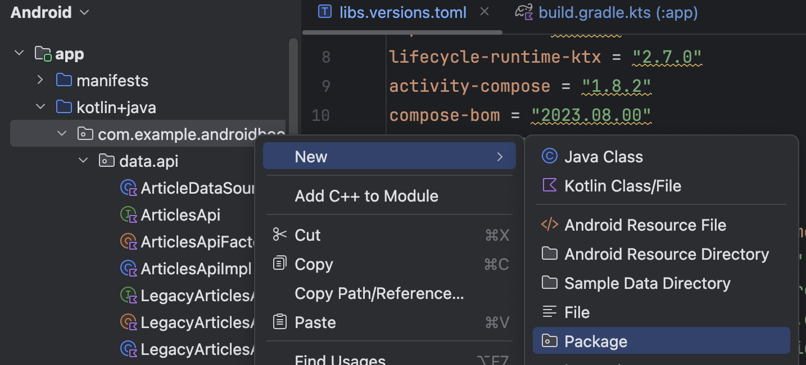
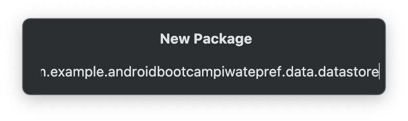
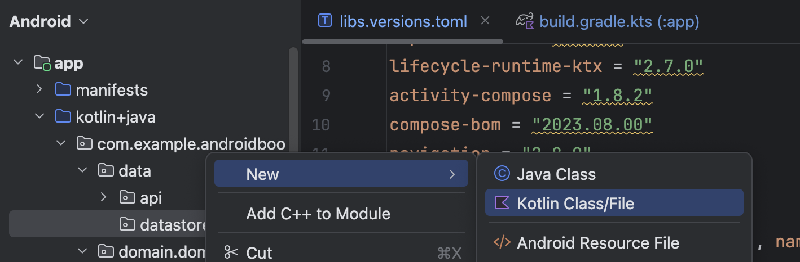
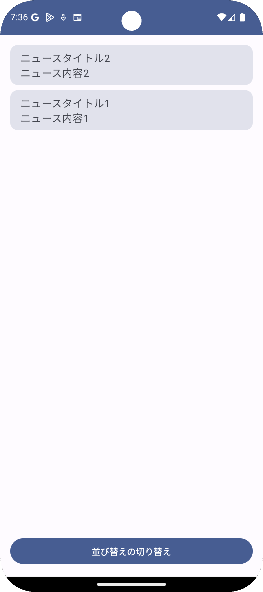
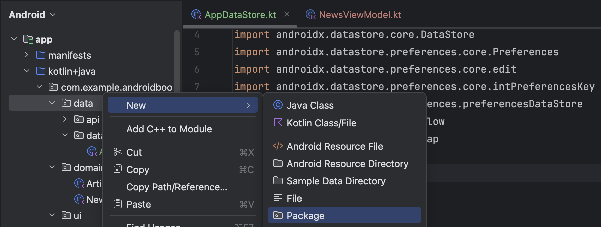

# 3. DataStore

## DataStoreとは
DataStoreとは、データを永続化[^1]させるためのAndroidの公式ライブラリで、Preference DataStore、Proto DataStoreがあります。　

[^1]: アプリを終了してもデータを保ち続けること　

### Preference DataStore
データに対して一意のキーを使用し、読み書きすることができます。  

### Proto DataStore
Protocol Buffersを使用してスキーマを定義し、カスタムデータ型としてデータを保存することができます。  

## DataStoreを使ってデータを永続化させてみよう
今回は2種類あるDataStoreのうち、Preference DataStoreを使ってデータを永続化させます。  
ここでは前の章で作成したニュースリストの並び順（昇順・降順）を永続化させましょう。


### 依存追加
まず、バージョンカタログに今回使うライブラリを追加してsyncしましょう。  
```toml
androidx-datastore-preferences = { module = "androidx.datastore:datastore-preferences", version = "1.1.0" }
```

次に`app/build.gradle.kts`のdependenciesにバージョンカタログに追加したライブラリを追加してsyncましょう。  

```kt
dependencies {
    implementation(libs.androidx.datastore.preferences)
    ...
}
```

### DataStoreでの登場人物
#### PreferenceDataStoreFactory
PreferenceDataStoreを作るためのFactory。  
データを永続化させるためのファイルパスやデータを読み書きする際のCoroutineScopeなどを渡してPreferenceDataStoreを生成します。

#### intPreferenceKey
Int型のデータを永続化させるためのKey。

### DataStoreの実装

DataStoreを実装していきましょう。

まず`com.example.androidbootcampiwatepref.data.datastore`パッケージを追加します。  
`com.example.androidbootcampiwatepref`のパッケージを右クリックし、`New` > `Package`を選択します。



`New Package`ウィンドウが表示されたら、`com.example.androidbootcampiwatepref.data.datastore`を入力し、Enterを押します。



`datastore`パッケージができたら、そのパッケージを右クリックし、`New` > `Kotlin Class/File`を選択し、`AppDataStore`を作成します。



空の`AppDataStore`が作成できたら、以下のように修正をします。


```kt
import android.content.Context
import androidx.datastore.core.DataStore
import androidx.datastore.preferences.core.Preferences
import androidx.datastore.preferences.core.edit
import androidx.datastore.preferences.core.intPreferencesKey
import androidx.datastore.preferences.preferencesDataStore
import kotlinx.coroutines.flow.Flow
import kotlinx.coroutines.flow.map

class AppDataStore(
    private val context: Context
) {
    companion object {
        private const val USER_PREFERENCES_NAME = "user_preferences"
        val KEY_NEWS_LIST_ORDER = intPreferencesKey("key_news_list_order")
    }

    private val Context.dataStore: DataStore<Preferences> by preferencesDataStore(
        name = USER_PREFERENCES_NAME
    )

    /**
     * 永続化されたニュースリストの並び順を取得するFlow。
     */
    val newsListOrder: Flow<NewsListOrder>
        get() = context.dataStore.data.map { preferences ->
            NewsListOrder.fromValueOrDefault(
                value = preferences[KEY_NEWS_LIST_ORDER]
            )
        }

    /**
     * ニュースリストの並び順を切り替える。
     */
    suspend fun toggleNewListOrder() {
        context.dataStore.edit { preferences ->
            // 現在の並び順を取得
            val currentOrder = NewsListOrder.fromValueOrDefault(
                value = preferences[KEY_NEWS_LIST_ORDER]
            )
            // 並び順を切り替える
            val newOrder = when (currentOrder) {
                NewsListOrder.ID_ASCENDING -> NewsListOrder.ID_DESCENDING
                NewsListOrder.ID_DESCENDING -> NewsListOrder.ID_ASCENDING
            }
            // 新しい並び順を保存
            preferences[KEY_NEWS_LIST_ORDER] = newOrder.value
        }
    }

    enum class NewsListOrder(val value: Int) {
        ID_ASCENDING(0),
        ID_DESCENDING(1),
        ;

        companion object {
            val DEFAULT = ID_ASCENDING

            fun fromValueOrDefault(value: Int?): NewsListOrder {
                return NewsListOrder.entries
                    .firstOrNull { it.value == value }
                    ?: DEFAULT
            }
        }
    }
}
```

### `NewsViewModel`で`AppDataStore`を利用する

`AppDataStore`ができたら、`NewsViewModel`を以下のように修正します。

```kotlin
import com.example.androidbootcampiwatepref.data.datastore.AppDataStore
import kotlinx.coroutines.flow.combine

class NewsViewModel(
    private val dataStore: AppDataStore,
) : ViewModel() {

    /** dummyDataSourceなどは省略 **/

    init {
        viewModelScope.launch {
            // dummyDataSourceとdataStoreのニュースリストの並び順を組み合わせて購読する
            combine(
                dummyDataSource,
                dataStore.newsListOrder,
                ::Pair
            ).collect { (newsList, newsListOrder) ->
                // 新しいニュースリストを受け取ったら、UI状態を更新する
                val sortedNewsList = when (newsListOrder) {
                    // 並び順に応じてニュースリストをソートする
                    AppDataStore.NewsListOrder.ID_ASCENDING -> newsList.sortedBy { it.id }
                    AppDataStore.NewsListOrder.ID_DESCENDING -> newsList.sortedByDescending { it.id }
                }
                // 並び替えたニュースリストでUI状態を更新する
                mutableUiState.value = NewsUiState(newsList = sortedNewsList)
            }
        }
    }

    fun toggleNewsListOrder() {
        viewModelScope.launch {
            // 並び替えを切り替える
            dataStore.toggleNewListOrder()
        }
    }
}
```

### 並び替えボタンの追加

`MainActivity`に並び替えボタンを設置します。

```kotlin
import androidx.compose.foundation.layout.Column
import androidx.compose.foundation.layout.fillMaxWidth
import androidx.compose.foundation.layout.padding
import androidx.compose.material3.Button
import androidx.compose.ui.platform.LocalContext
import androidx.compose.ui.unit.dp
import com.example.androidbootcampiwatepref.data.datastore.AppDataStore

class MainActivity : ComponentActivity() {
    override fun onCreate(savedInstanceState: Bundle?) {
        super.onCreate(savedInstanceState)
        setContent {
            AndroidBootcampIwatePrefTheme {
                // A surface container using the 'background' color from the theme
                Surface(
                    modifier = Modifier.fillMaxSize(),
                    color = MaterialTheme.colorScheme.background
                ) {
                    val context = LocalContext.current
                    val newsViewModel = viewModel {
                        NewsViewModel(
                            dataStore = AppDataStore(context = context),
                        )
                    }
                    val uiState by newsViewModel.uiState.collectAsStateWithLifecycle()

                    Column {
                        NewsList(
                            newsList = uiState.newsList,
                            modifier = Modifier.weight(1f)
                        )
                        Button(
                            onClick = { newsViewModel.toggleNewsListOrder() },
                            modifier = Modifier.fillMaxWidth().padding(16.dp),
                        ) {
                            Text(text = "並び替えの切り替え")
                        }
                    }
                }
            }
        }
    }
}
```

ここまでできたら実行してみましょう。  
並び替えが切り替えでき、且つアプリを一度閉じた後も、その並び替えが維持されていれば成功です。



## Repositoryでデータソースを隠蔽する【発展的】

今のままでもデータの永続化ができ、アプリの機能実装はできます。  
しかし、UIレイヤーである`UI(Compose)`や`VieModel`からデータソースを直接参照するのは推奨されません。

先ほど実装した`AppDataStore`はデータソースに該当し、`NewsViewModel`から直接参照しているので、推奨された形になっていません。  
これを推奨される形で修正してみましょう。

### `NewsListOrderRepository`の追加

`data`パッケージを右クリックし、`New` > `Package`を選択します。  
`New Package`ウィンドウが出たら`com.example.androidbootcampiwatepref.data.repository`を入力して、Enterを押します。



`repository`パッケージができたら、そのパッケージを右クリックし、`NewsListOrderRepository`を作成します。

### AppDataStoreの修正

以下のコードのように修正します。

主な差分

1. `getNewsListOrder`メソッドの追加
1. デフォルト並び順の定義を削除

```kotlin
import android.content.Context
import androidx.datastore.core.DataStore
import androidx.datastore.preferences.core.Preferences
import androidx.datastore.preferences.core.edit
import androidx.datastore.preferences.core.intPreferencesKey
import androidx.datastore.preferences.preferencesDataStore
import kotlinx.coroutines.flow.Flow
import kotlinx.coroutines.flow.firstOrNull
import kotlinx.coroutines.flow.map

class AppDataStore(
    private val context: Context
) {
    companion object {
        private const val USER_PREFERENCES_NAME = "user_preferences"
        val KEY_NEWS_LIST_ORDER = intPreferencesKey("key_news_list_order")
    }

    private val Context.dataStore: DataStore<Preferences> by preferencesDataStore(
        name = USER_PREFERENCES_NAME
    )

    /**
     * 永続化されたニュースリストの並び順を取得するFlow。
     */
    val newsListOrder: Flow<NewsListOrder?>
        get() = context.dataStore.data.map { preferences ->
            NewsListOrder.fromValueOrNull(
                value = preferences[KEY_NEWS_LIST_ORDER]
            )
        }

    /**
     * 永続化されたニュースリストの並び順を取得する。
     */
    suspend fun getNewsListOrder(): NewsListOrder? {
        return context.dataStore.data.firstOrNull()
            ?.let { preferences ->
                NewsListOrder.fromValueOrNull(
                    value = preferences[KEY_NEWS_LIST_ORDER]
                )
            }
    }

    /**
     * ニュースリストの並び順を設定する。
     */
    suspend fun setNewsListOrder(order: NewsListOrder) {
        context.dataStore.edit { preferences ->
            preferences[KEY_NEWS_LIST_ORDER] = order.value
        }
    }

    enum class NewsListOrder(val value: Int) {
        ID_ASCENDING(0),
        ID_DESCENDING(1),
        ;

        companion object {
            fun fromValueOrNull(value: Int?): NewsListOrder? {
                return NewsListOrder.entries.firstOrNull { it.value == value }
            }
        }
    }
}
```

### `NewsListOrderRepository`の修正
空の`NewsListOrderRepository`クラスができたら、以下のように修正します。

```kotlin
import android.content.Context
import com.example.androidbootcampiwatepref.data.datastore.AppDataStore
import com.example.androidbootcampiwatepref.data.repository.NewsListOrderRepository.NewsListOrder.ID_ASCENDING
import com.example.androidbootcampiwatepref.data.repository.NewsListOrderRepository.NewsListOrder.ID_DESCENDING
import kotlinx.coroutines.flow.Flow
import kotlinx.coroutines.flow.map

class NewsListOrderRepository(
    private val dataStore: AppDataStore,
) {

    /**
     * ニュースリストの並び順を取得するFlow。
     */
    val newsListOrder: Flow<NewsListOrder>
        get() = dataStore.newsListOrder.map {
            // nullの場合はデフォルトの並び順を返す
            it?.toRepositoryModel() ?: NewsListOrder.DEFAULT
        }

    /**
     * ニュースリストの並び順を切り替える。
     */
    suspend fun toggleNewListOrder() {
        // 現在の並び順を取得
        val currentOrder = dataStore.getNewsListOrder()?.toRepositoryModel()

        // 現在の並び順がnullの場合は、デフォルトの並び順を切り替えて設定する
        if (currentOrder == null) {
            val defaultOrder = NewsListOrder.DEFAULT
            dataStore.setNewsListOrder(defaultOrder.toggle().toAppDataStoreModel())
            return
        }

        // 並び順を切り替えて設定する
        val newOrder = currentOrder.toggle().toAppDataStoreModel()
        dataStore.setNewsListOrder(newOrder)
    }

    enum class NewsListOrder {
        ID_ASCENDING,
        ID_DESCENDING,
        ;

        fun toggle(): NewsListOrder {
            return when (this) {
                ID_ASCENDING -> ID_DESCENDING
                ID_DESCENDING -> ID_ASCENDING
            }
        }

        companion object {
            val DEFAULT = ID_ASCENDING
        }
    }

    private fun NewsListOrder.toAppDataStoreModel(): AppDataStore.NewsListOrder {
        return when (this) {
            ID_ASCENDING -> AppDataStore.NewsListOrder.ID_ASCENDING
            ID_DESCENDING -> AppDataStore.NewsListOrder.ID_DESCENDING
        }
    }

    private fun AppDataStore.NewsListOrder.toRepositoryModel(): NewsListOrder {
        return when (this) {
            AppDataStore.NewsListOrder.ID_ASCENDING -> ID_ASCENDING
            AppDataStore.NewsListOrder.ID_DESCENDING -> ID_DESCENDING
        }
    }

    class Factory(
        private val context: Context,
    ) {
        fun create(): NewsListOrderRepository {
            return NewsListOrderRepository(
                dataStore = AppDataStore(context = context),
            )
        }
    }
}
```

### `MainActivity`の修正

以下のように修正します。

1. `import com.example.androidbootcampiwatepref.data.datastore.AppDataStore`を削除する。
1. `import com.example.androidbootcampiwatepref.data.repository.NewsListOrderRepository`を追加する。
1. `NewsViewModel`のコンストラクタ引数を修正する。

```diff
// AppDataStoreへの参照がなくなり、NewsListOrderRepositoryへの参照に変わっている
- import com.example.androidbootcampiwatepref.data.datastore.AppDataStore
+ import com.example.androidbootcampiwatepref.data.repository.NewsListOrderRepository
import com.example.androidbootcampiwatepref.domain.domainobject.News
import com.example.androidbootcampiwatepref.ui.theme.AndroidBootcampIwatePrefTheme
import com.example.androidbootcampiwatepref.viewmodel.NewsViewModel

class MainActivity : ComponentActivity() {
    override fun onCreate(savedInstanceState: Bundle?) {
        super.onCreate(savedInstanceState)
        setContent {
            AndroidBootcampIwatePrefTheme {
                // A surface container using the 'background' color from the theme
                Surface(
                    modifier = Modifier.fillMaxSize(),
                    color = MaterialTheme.colorScheme.background
                ) {
                    val context = LocalContext.current
                    val newsViewModel = viewModel {
                        NewsViewModel(
-                            dataStore = AppDataStore(context = context),
+                            newsListOrderRepository = NewsListOrderRepository.Factory(context).create(),
                        )
                    }
                    val uiState by newsViewModel.uiState.collectAsStateWithLifecycle()

                    Column {
                        NewsList(
                            newsList = uiState.newsList,
                            modifier = Modifier.weight(1f)
                        )
                        Button(
                            onClick = { newsViewModel.toggleNewsListOrder() },
                            modifier = Modifier.fillMaxWidth().padding(16.dp),
                        ) {
                            Text(text = "並び替えの切り替え")
                        }
                    }
                }
            }
        }
    }
}
```

ここまでできたら、ビルドして動作確認しましょう。  
挙動は何も変わっていないことがわかります。

### 解説

コードが増えただけで挙動が変わっていないので、一見すると何のメリットも無いように思います。  
しかし`Repository`を作成することで、以下のようなメリットが生まれています。

1. データソースの差し替えがしやすくなっている
    - データソースが変更されても、変更の影響範囲がUIレイヤーに及ばない
    - 例）アプリ側での永続化ではなく、サーバ側での永続化に変更する
1. 「デフォルト値の決定」と「並び替えの処理」が、ビジネスロジックとしてシンプルに書ける
    - 修正前は永続化されたデータへのアクセスの実装詳細も含める必要があったが、Repository側に寄せることでビジネスロジック（サービス仕様）がわかりやすい
    - テスタビリティも向上


このような「責務の分離」を意識した実装をすることで、将来的な改修がしやすくなったり、テストがしやすくなり、サービスの保守性が上がります。
