# アプリアイコンを設定しよう

Day2・Day3の課題で作成したアプリには、Android Studioでプロジェクトを作成したときのデフォルトアイコンが設定されています。
このセクションでは、生成AIを使ってオリジナルのアイコンを作成し、自分だけのアプリに仕上げましょう！

## Androidアプリアイコンの基礎知識

### アイコンの形状は端末によって異なる

Androidのアプリアイコンは、機種やユーザーの設定によって様々な形状で表示されます。
丸、四角、角丸、星型など、同じアイコン画像でも見え方が変わります。

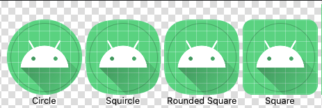

そのため、Androidアプリのアイコンは **「どのような形に切り抜かれても問題ないデザイン」** にする必要があります。

### Adaptive Icon（アダプティブアイコン）

Android 8.0（API 26）以降では、**Adaptive Icon**[^1] という仕組みが導入されています。

Adaptive Iconは以下の2つのレイヤーで構成されます：

| レイヤー | 役割 |
|---------|------|
| **Foreground（前景）** | アイコンのメイン要素（キャラクター、シンボルなど） |
| **Background（背景）** | 背景色や背景パターン |

この2つのレイヤーを組み合わせることで、端末側が自由に形状を切り抜いたり、視差効果[^2]を適用したりできます。

### セーフエリアを意識する

Adaptive Iconでは、**中央の66dp四方**がセーフエリア（安全領域）とされています。
重要な要素はこのエリア内に収めることで、どの形状に切り抜かれても欠けることがありません。

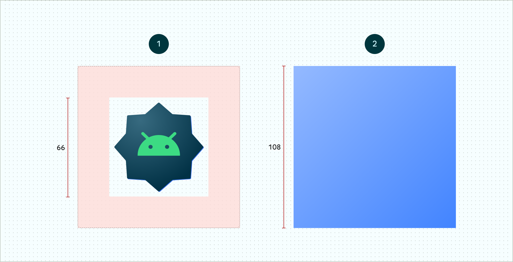

図1: フォアグラウンドとバッググラウンドレイヤー・セーフエリアのイメージ


図2: フォアグラウンドとバッググラウンドレイヤーに円形のマスクを適用した例


## 生成AIでアイコン画像を作成する

### Google Gemini を使う

今回は **Google Gemini** の画像生成機能を使って、アプリアイコン用の画像を作成します。

1. [Google Gemini](https://gemini.google.com/app) にアクセス
2. Googleアカウントでログイン
3. テキストフォーム下部の **「ツール」ボタン** をクリック
4. **「画像を作成」** を選択して有効化

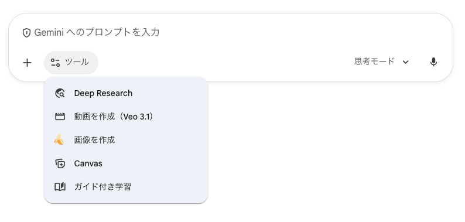

### プロンプトのテンプレート

以下のテンプレートを使って、アプリアイコンに適した画像を生成しましょう。
`{...}` の部分を自分のアプリに合わせて変更してください。

```
# Role
あなたは熟練のUIデザイナーです。Google Playストアの提出仕様に完全に準拠した、高品質なAndroidアプリアイコンの**素材画像**を生成してください。

# Icon Specification (固定ルール・最重要)
- **Canvas Shape**: **完全な正方形 (Full Square Canvas)**。
  - **禁止事項**: **絶対に角を丸くしないでください。** スクワークル形状のマスク、アイコン自体の影（ドロップシャドウ）、浮き上がり効果は一切不要です。角まで完全に塗りつぶされた、平面的な正方形画像を出力してください。
- **Background Fill**: 指定された背景色で、キャンバスの端から端まで完全に塗りつぶしてください。白い余白を残さないでください。
- **Layout**: 重要な要素（キャラクターなど）は必ず画像の中央(セーフエリア)に配置し、将来的に四隅が円形に切り取られても欠けないよう、周囲に十分な背景色の余白を持たせること。
- **Restriction**: 文字(Text)は一切含めないこと。

# Design Parameters (今回の変数)
- **Subject**: {ここに主題を入れる：例「ヘッドフォンをしたバナナ」}
- **Style**: {ここにスタイルを入れる：例「フラットデザイン、ミニマリスト」}
- **Background**: {ここに背景を入れる：例「クリーム色の単色」}
- **Mood**: {ここに雰囲気を入れる：例「ポップ、元気が出る」}

# Output Instruction
上記の厳格な仕様に基づき、提出用素材となる正方形のアイコン画像を1枚生成してください。
```

### プロンプト例

ToDoアプリのアイコンを作る場合：

```
# Design Parameters (今回の変数)
- **Subject**: チェックマークがついたかわいいノート
- **Style**: マテリアルデザインに準拠したフラットなスタイル
- **Background**: パステルブルーの単色
- **Mood**: 清潔感、達成感
```

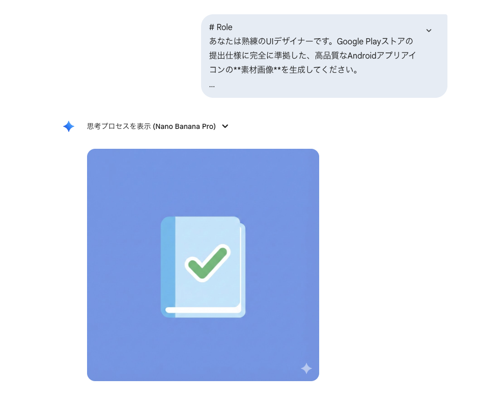

### 生成した画像を調整する

生成された画像が気に入らない場合は、追加のリクエストを送ることで調整できます。

```
本ではなくクリップボードにできますか？
それ以外の背景や正方形の形状は絶対に維持してください。
```

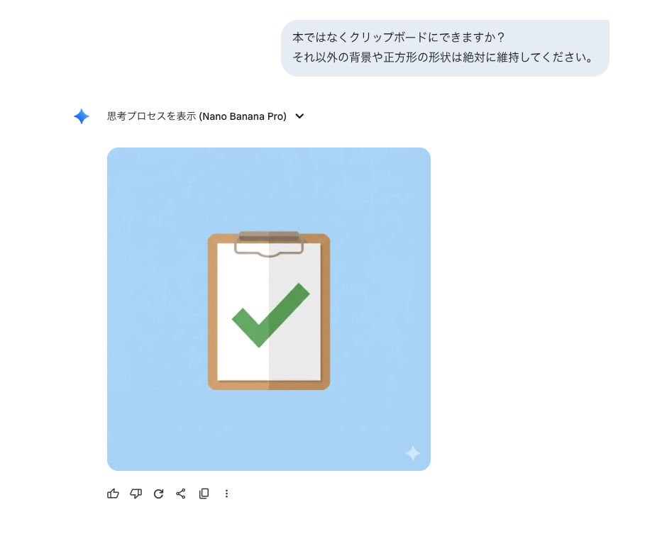  

> [!IMPORTANT]
> 画像が生成できたら、生成画像右上のボタンから**ダウンロード**して保存しておきましょう。  
> 正方形で一辺が512px以上であればOKです。また、右下の透かしはそのままでも問題ありません。


## Image Asset Studio でアイコンを設定する

Android Studioには **Image Asset Studio** という、アプリアイコンを簡単に設定できるツールが用意されています。

### Image Asset Studio を開く

1. Android Studioでプロジェクトを開く
2. Projectツールウィンドウで `app/src/main/res` フォルダを右クリック
3. **[New] > [Image Asset]** を選択

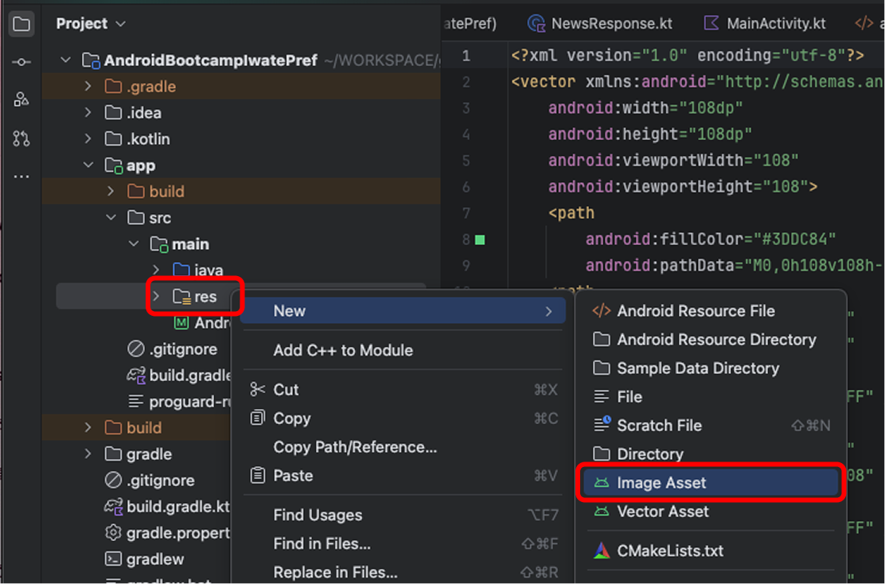  

### Foreground Layer の設定

Image Asset Studioが開いたら、以下の手順でForeground（前景）を設定します。

1. **Icon Type** が `Launcher Icons (Adaptive and Legacy)` になっていることを確認
2. **Foreground Layer** タブを選択
3. **Source Asset** の **Asset Type** を `Image` に変更
4. **Path** の右側にあるフォルダアイコンをクリック
5. 先ほどダウンロードした画像を選択

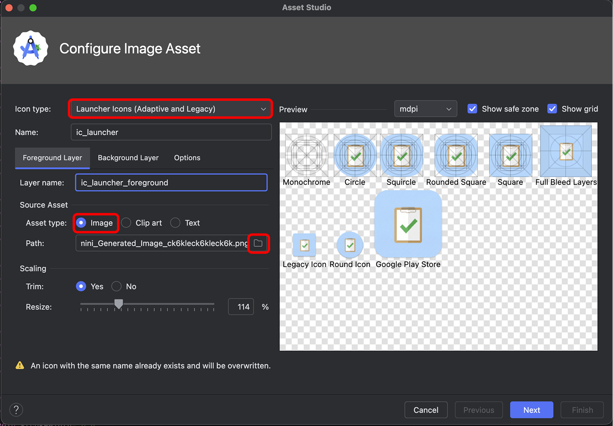  

> [!TIP]
> プレビューを見ながら、**Resize**スライダーでサイズを調整できます。
> 重要な要素がセーフエリア（円形の内側）に収まるようにしましょう。

### Background Layer の設定

次に、Background（背景）を設定します。

1. **Background Layer** タブを選択
2. **Source Asset** の **Asset Type** を `Color` に変更
3. **Color** をクリックして、Foreground画像に合った色を選択
   - Foreground画像の背景色に近い色を選ぶと統一感が出ます

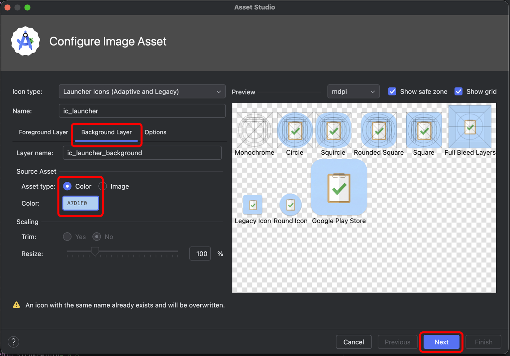  

### アイコンの生成

設定が完了したら、アイコンを生成します。

1. 右下の **[Next]** をクリック
2. 確認画面で生成されるファイルを確認
3. **[Finish]** をクリック

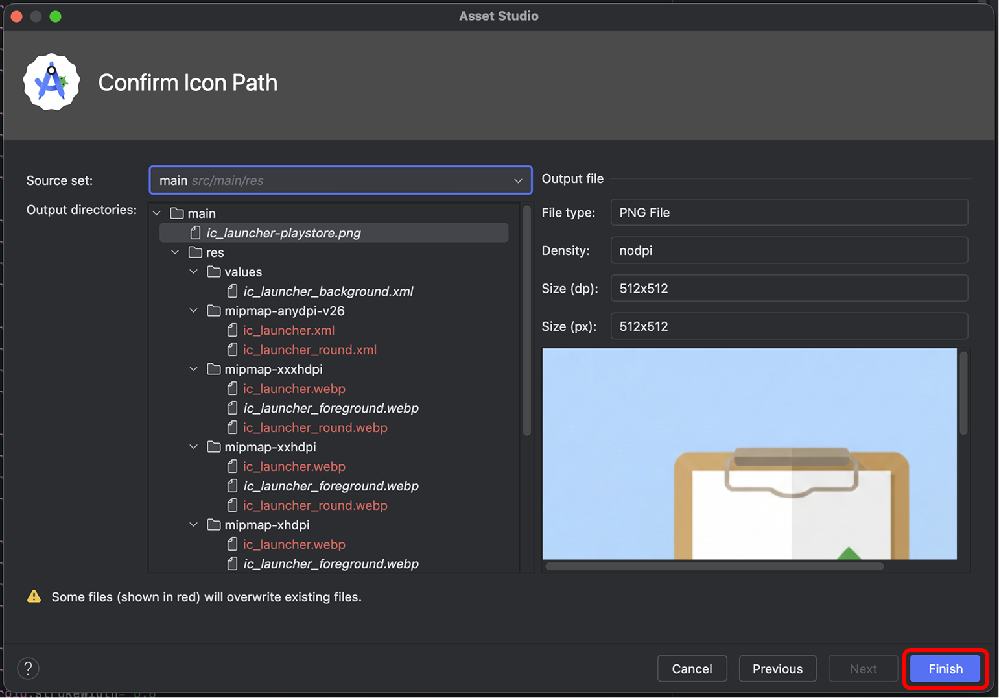  

以下のようなファイルが自動的に生成されます：

```
app/src/main/res/
├── mipmap-anydpi-v26/
│   └── ic_launcher.xml        ← Adaptive Icon定義
├── mipmap-hdpi/
│   └── ic_launcher.webp       ← 高解像度用
├── mipmap-mdpi/
│   └── ic_launcher.webp       ← 中解像度用
├── mipmap-xhdpi/
│   └── ic_launcher.webp       ← 超高解像度用
├── mipmap-xxhdpi/
│   └── ic_launcher.webp       ← 超超高解像度用
└── mipmap-xxxhdpi/
    └── ic_launcher.webp       ← 超超超高解像度用
```

> [!NOTE]
> 既存のアイコンファイルを上書きするか確認されたら、**[OK]** をクリックしてください。

## アプリをビルドして確認する

アイコンの設定が完了したら、アプリをビルドして確認しましょう。

| ホーム画面 | スプラッシュ画面 |
|---|---|
| 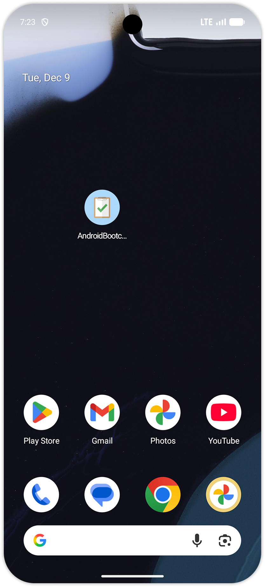 | 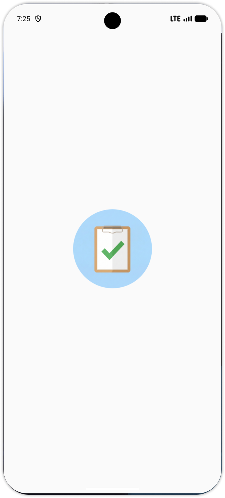 |

## 補足1：Android 16以降のカラーテーマ対応

Android 13以降では、ユーザーが端末の設定で「テーマアイコン」を有効にすると、アプリアイコンが端末のテーマカラーに合わせて表示されます。

本来はモノクロ用のアイコン（Monochrome Layer）を別途用意する必要がありますが、**Android 16 QPR2以降**では、モノクロアイコンを指定していない場合でも、Foreground画像を自動的にグレースケール化してテーマカラーを適用してくれるようになりました。

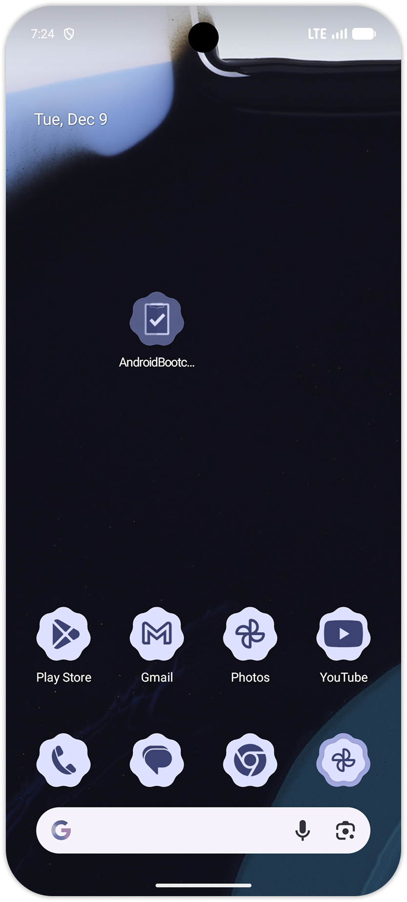

> [!NOTE]
> 今回設定したアイコンも、Android 16以降の端末でテーマアイコンを有効にすると、自動的にテーマカラーが適用されます。
> より洗練されたモノクロアイコンを設定したい場合は、Image Asset Studioの **Options** タブから設定できます。

## 補足2：アプリ名を変更する

アプリの表示名を変更する場合は以下の手順で変更できます。

### 手順

1. `app/src/main/res/values/strings.xml` を開く
2. `app_name` の値を好きな名前に変更する

```xml
<resources>
    <string name="app_name">My ToDo App</string>
</resources>
```

3. アプリを再ビルドして確認

ホーム画面やアプリ一覧で、変更した名前が表示されていれば成功です！

## まとめ

このセクションでは以下のことを学びました：

- Androidアプリアイコンは端末によって様々な形状で表示される
- Adaptive Iconは Foreground と Background の2レイヤーで構成される
- 生成AIを使ってアイコン用の画像を作成できる
- Image Asset Studioで簡単にアイコンを設定できる

次のセクションでは、このアプリをAPKファイルとして書き出し、みんなに共有してみましょう。

---

## 参考リンク

- [Adaptive Icon - Android Developers](https://developer.android.com/develop/ui/views/launch/icon_design_adaptive?hl=ja)
- [Image Asset Studio でアプリアイコンを作成する - Android Developers](https://developer.android.com/studio/write/create-app-icons?hl=ja)
- [Google Gemini](https://gemini.google.com/app)

[^1]: Adaptive Icon - Android 8.0以降で導入された、端末やランチャーに応じて形状が変化するアイコンの仕組み  
[^2]: 視差効果（パララックス効果）- 端末を傾けたときにForegroundとBackgroundが少しずれて動くことで、奥行きを感じさせる効果
