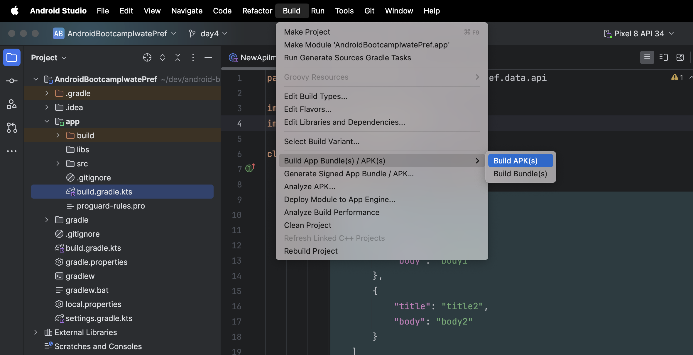
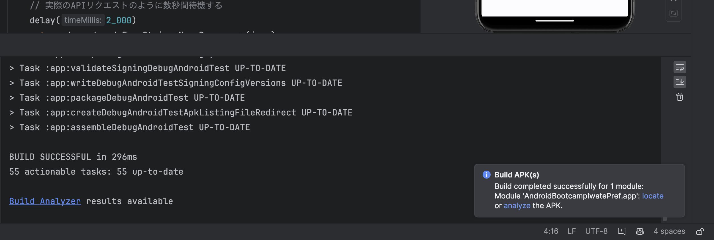
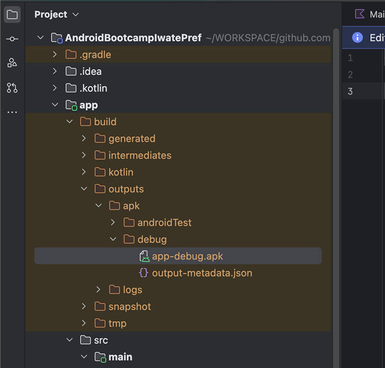
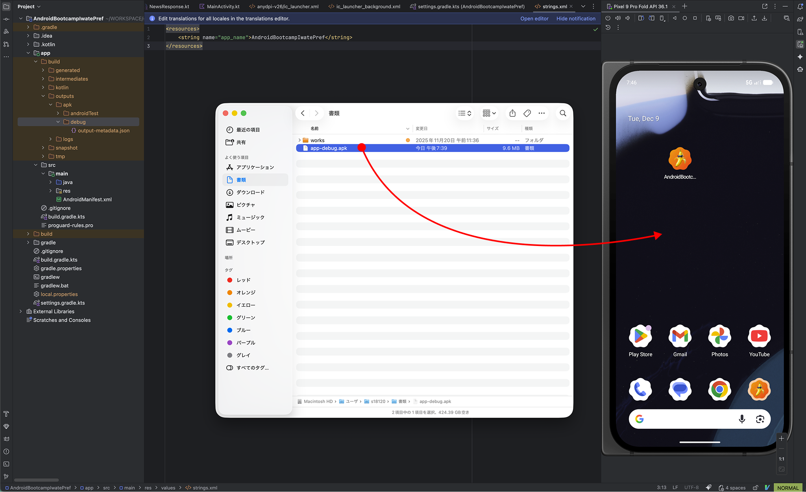

# Androidアプリの配布

Androidアプリは配布用のファイルを作成することができます。  
これによって都度ビルドしなくても、誰かにアプリを配布することができます。

配布用のファイルには2種類あります。
- `.apk` - Android package
- `.aab` - Android App Bundle

`.aab`の方が後発で`.apk`よりメリットが多いですが、`.aab`はGoogle Playでの配布用途なので、それ以外で配布したい場合は`.apk`を利用します。

## APKファイルの作成

Android Studio でAPKファイルを作成することができます。

まず Build > Build App Bundle(s) / APK(s) > Build APK(s)を選択します。

> [!NOTE]
> Mac版で説明しているので、Windows版とは若干異なる可能性があります



ビルドが成功すると、右下にポップアップが表示されます。



locateを選択するとAPKが出力された場所が開かれます。  
(デフォルトでは`app-debug.apk`というファイル名)



AndroidStudioのファイルツリーからも `app-debug.apk` を確認できます。  
`app/build/outputs/apk/debug/app-debug.apk` に生成

## APKファイルの共有

APKファイルをSlackチャンネルに投稿してみましょう。
他の人のAPKが投稿されたら、それをダウンロード〜インストールしてみましょう。


--- 

## 補足 : APKファイルをエミュレータ・実機にインストールする

作成したAPKファイルをエミュレータやUSB接続した実機にインストールする方法を紹介します。

### 方法1：Running Devices パネルにドラッグ&ドロップ

最も簡単な方法です。

1. Android Studio でエミュレータを起動、または実機をUSB接続する
2. **[View] > [Tool Windows] > [Running Devices]** でRunning Devicesパネルを開く
3. APKファイルをRunning Devicesパネルにドラッグ&ドロップ




### 方法2：adb コマンドを使う

ターミナル（コマンドプロンプト）から `adb` コマンドを使ってインストールすることもできます。

```bash
# app-debug.apk が存在するディレクトリ上で実行するか
# app-debug.apk へのパスを指定する必要があります
adb install app-debug.apk
```

複数のデバイスが接続されている場合は、`-s` オプションでデバイスを指定します：

```bash
# 接続中のデバイス一覧を確認
adb devices

# 特定のデバイスにインストール
adb -s emulator-5554 install app-debug.apk
```
