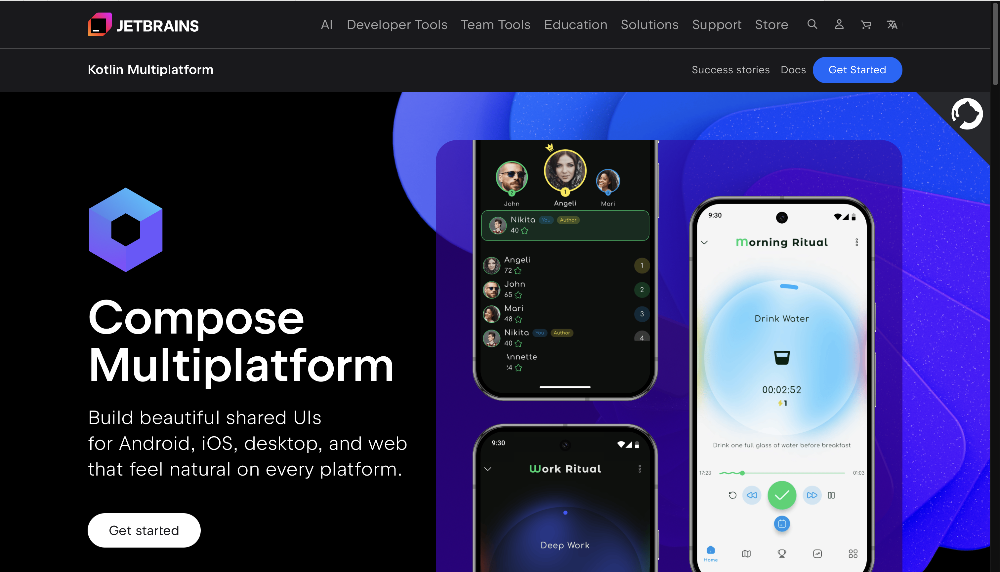
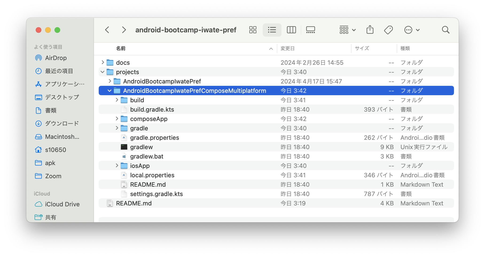
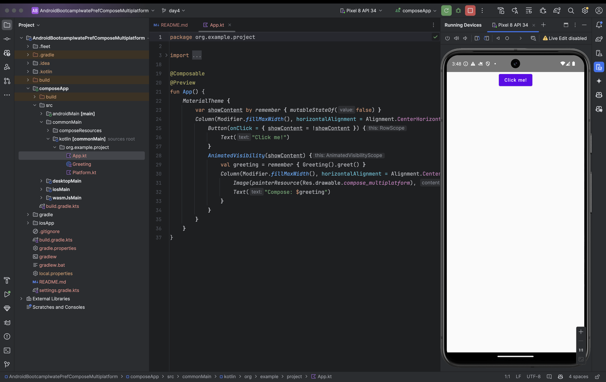
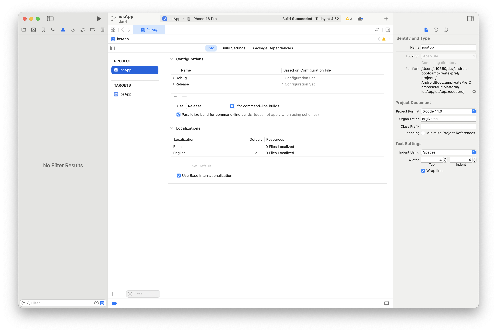
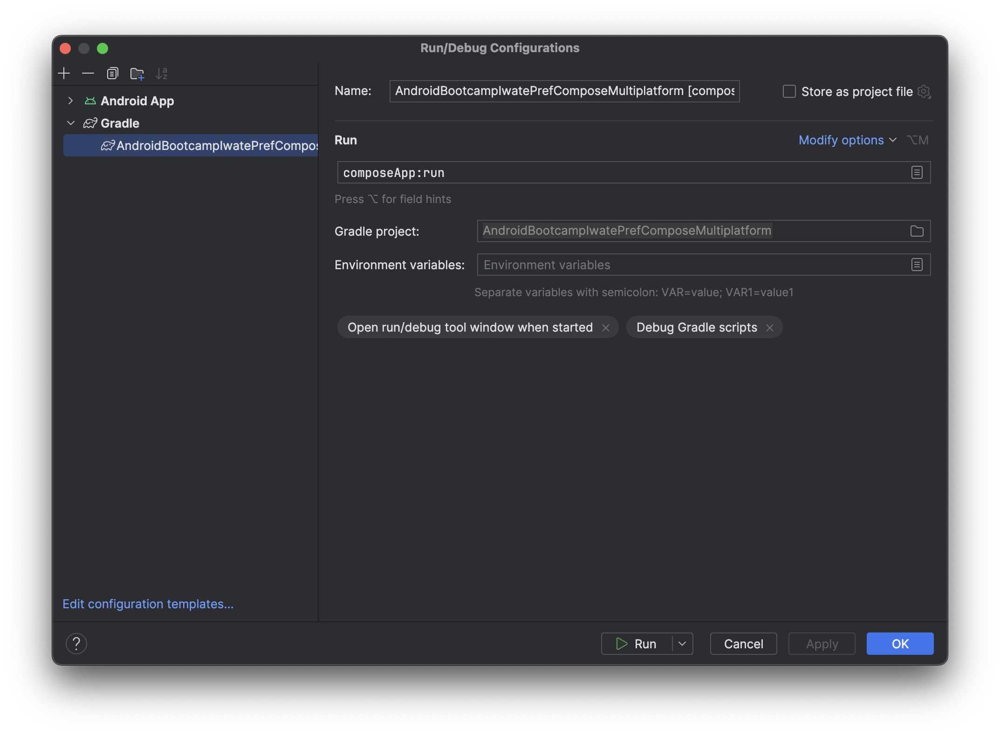
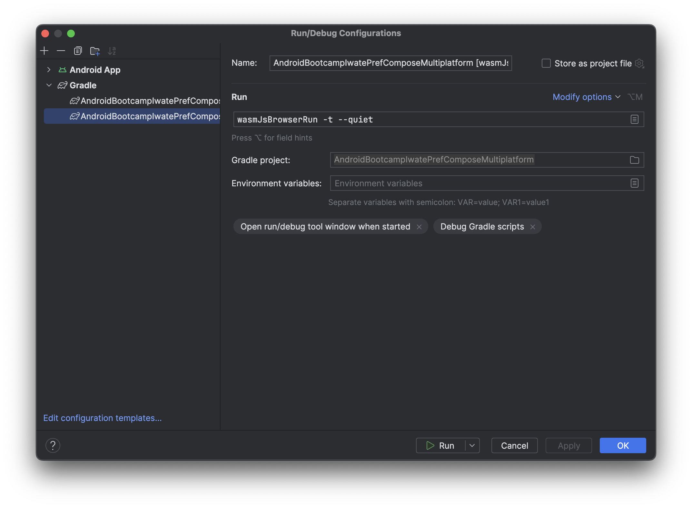

# Androidの将来性

このブートキャンプでは、いわゆるネイティブアプリ開発を学んできました。  
一方で Flutter や React Native といったクロスプラットフォーム技術[^1]が近年は人気で、様々なプロダクトで導入されており、「Androidのネイティブアプリ開発を学ぶ意義ってなんだろう？」と不思議に思った方も少なくないでしょう。

それに対する満点の回答はありませんが、一つの考え方として「いち早くプラットフォームに最適化したものが作れる」という点があります。

ここでは Android プラットフォームの将来性を知り、モバイルだけではないAndroidアプリ開発の広がりを感じていきましょう。

> [!IMPORTANT]
> クロスプラットフォーム技術を採用するかは、事業やチームの特性によって変わります。

[^1]: 一つのソースコードでiOSやAndroidといった複数の環境で動作するアプリケーションを作成する技術

## プラットフォームとしての将来性
Android OSが搭載されるデバイスはモバイル端末だけではありません。  
Android搭載のテレビも珍しくなくなり、Android搭載のスマートウォッチや車載デバイスも普及しました。

そして最近注目を集めているのが、Android XR と Aluminium OS です。

### Android XR

Android XR は ヘッドセットやゴーグルなどXR[^2]デバイス向けのOSです。

- [Android XR の詳細](https://www.android.com/intl/ja_jp/xr/)
- [The Android Show | XR Edition](https://www.android.com/xr/show/)

Android XR 向けのAPIはすでに利用可能で、開発者はすぐに試すことができます。また馴染んだ Android Studio と Jetpack Compose を用いて、すぐにXR向けのUIを作ることができます。  

つまりは、ブートキャンプを終えた時点で、モバイル以外のTV・スマートウォッチ・車載デバイス・AIグラスなど、Android OSが搭載されたアプリのUIを作れるスキルをすでに得ています。

- [XR 向け Jetpack Compose で UI を開発する](https://developer.android.com/develop/xr/jetpack-xr-sdk/develop-ui?hl=ja)

[^2]: VR（仮想現実）、AR（拡張現実）、MR（複合現実）など、現実世界と仮想世界を融合させる技術の総称

### Aluminium OS

現在開発が進んでいると言われている Aluminium OS は Android と ChromeOS と統合した新しいOSと言われています。  
それにより、PCとその他Androidデバイスの連携がしやすくなることが期待されています。  

また、ベースがAndroidであることから、これまでモバイルで動作していたアプリもPC上で動く可能性がとても高く、開発者はより様々なサイズのデバイスへの対応を求められています。

ただ、その場合でも Jetpack Compose を用いた開発になるので、ブートキャンプで学んだことがそのまま活かすことができます。

## マルチプラットフォーム技術としての将来性
実は Jetpack Compose と同じコードでiOSアプリやWebページを作れるマルチプラットフォーム技術があります。  
それが [Compose Multiplatform](https://www.jetbrains.com/ja-jp/compose-multiplatform/) です。

2025年5月にはiOS向け機能も安定版になり、ComposeとKotlinの知識だけでiOSアプリもAndroidアプリも作れる環境ができました。

- [Compose Multiplatform 1.8.0 Released: Compose Multiplatform for iOS Is Stable and Production-Ready](https://blog.jetbrains.com/kotlin/2025/05/compose-multiplatform-1-8-0-released-compose-multiplatform-for-ios-is-stable-and-production-ready/)

## まとめ

Androidプラットフォームの今後の進化を知ることで、Androidのネイティブアプリ開発を学ぶことが、「Androidモバイルアプリ開発に限定したスキル」ではなく「さまざまなデバイスで動作するアプリ開発スキル」であることを感じられたと思います。  

そのようなAndroidプラットフォームの進化に伴って、自身の可能性が広がっていくことも、Androidアプリエンジニアの楽しいところです。

# （付録）iOSアプリ・Webページ・Desktopアプリをビルドしてみよう

android-bootcamp-iwate-pref > projects > AndroidBootcampIwatePrefComposeMultiplatformのプロジェクトをAndroidStudioで開きます。

これまで通り、まずはAndroidアプリとしてビルドしてみましょう。

※Macユーザ向け  
iOSアプリはXcodeで`iosApp/iosApp.xcodeproj`を開くことでアプリをビルドできます。

Desktopアプリは`composeApp:run`というコマンドを実行することで起動します。  
https://www.jetbrains.com/help/kotlin-multiplatform-dev/compose-multiplatform-create-first-app.html#run-your-application-on-desktop

Webページは`wasmJsBrowserRun -t --quiet`というコマンドを実行することで起動します。  
https://www.jetbrains.com/help/kotlin-multiplatform-dev/compose-multiplatform-create-first-app.html#run-your-web-application

