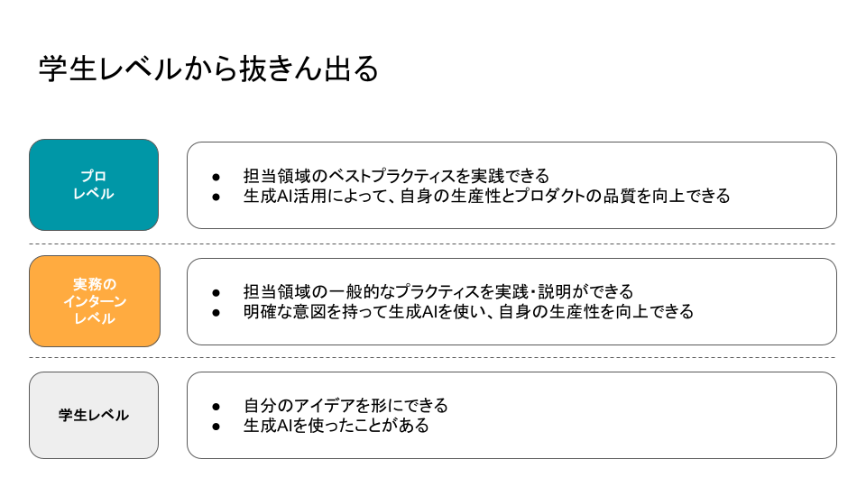

# Androidアプリ開発をさらに学ぶ

ここまでのブートキャンプの内容は、自分のアイデアを形にするのに最低限ものになっています。  
そのため、実務のインターン参加を目指すには、さらに学んでいく必要があります。

## 学生レベルから抜きん出る

生成AIの流れも相まって、実務のインターンや新卒の選考で求められるレベルもぐんぐん上がっています。  
実際どのくらいのレベルなのかは明言できませんが、「学生レベルから抜きん出る」ことは求められるでしょう。

学生レベルと実務のインターンレベルの差(一部)として、以下のものがあります。
- 担当領域の一般的なプラクティスを実践・説明ができるかどうか
- 明確な意図を持って生成AIを使い、自身の生産性の向上ができるかどうか

生成AIによりコーディングの効率はグッと上がりましたが、生成されたコードを人間がレビューし、プロダクトの品質を守り、向上できるかが重要になってきています。  
実務のインターンでも生成AIを活用はもはや必須ですが、そこで生成されたコードに問題がないのかセルフレビューできなくてはいけません。そのためにも担当領域のプラクティスの実践と説明を自身ができなくてはいけません。

生成AIの活用方法も重要です。  
生成AIのアウトプットは、どのようなコンテキストを与えるか、どのようなタスクを渡すかによって、大きく変わってきます。エンジニアは生成AIがアウトプットするプロセスを理解し、効果的に利用することが求められます。  

なお、生成AIによって人間が課題を認識する能力がとても重要になってきました。  
コーディングに限らず、身の回りのできことに対しても、以下の思考ができるように訓練すると良いでしょう。

1. コンテキスト(背景)の理解
1. 課題の整理
1. 課題解決のための仮説を立てる
1. 具体的なアプローチ
1. （この後の計画と実行はAIに任せる）

## 公式のトレーニングコースで学ぶ

https://developer.android.com/courses?hl=ja

Androidアプリ開発入門の書籍や記事はたくさんありますが、Android Developersで公開されているトレーニングコースが一番お勧めです。

書籍や記事と違い、更新性が高いので、モダンなAndroidアプリ開発が学べます。

トレーニングコースが完了すると、初心者レベルは超えて、長期インターンにトライするのに十分な知識が身につくと思います。

## 自分のアイデアを形にしていく

トレーニングコースが完了したら、個人開発にトライしてみましょう。  
その過程で良いコードの書き方を学んだり、バグ調査から知識を深めたり、より実践的なスキルが身についていきます。

## 技術に関するアウトプットをする

開発したアプリのコードをGitHubで公開したり、学びを記事に書いたりしてみましょう。  
Androidアプリ開発に限った話ではありませんが、アウトプットをすることで説明能力や知識がつくだけでなく、継続的に学び続ける姿勢がアピールできます。

技術は日々進歩するので、エンジニアにとって学び続けることは必須の能力です。